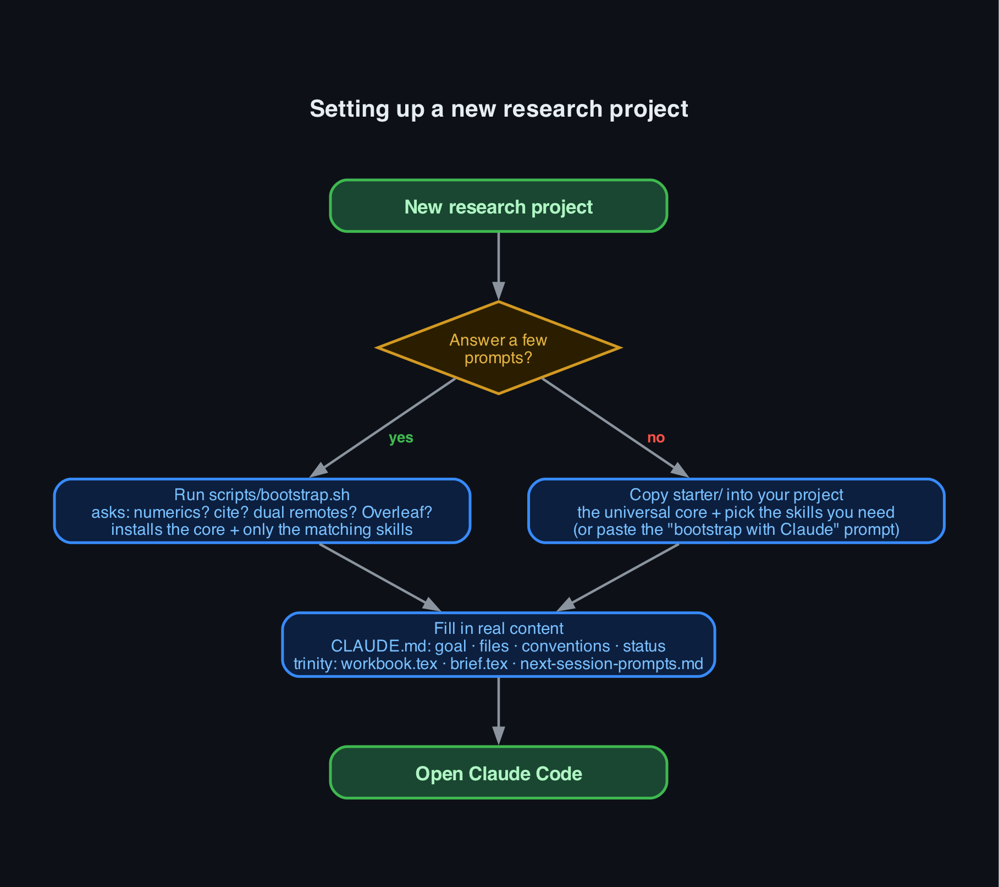
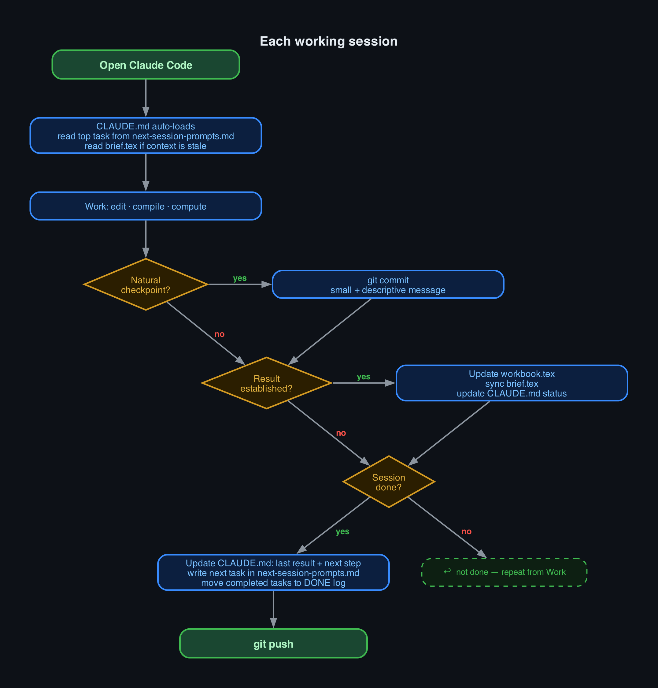

# Claude for Researchers

A practical guide and toolkit for researchers — especially physicists and mathematicians
— who want to use [Claude Code](https://claude.ai/code) productively on long, technically
demanding projects.

This guide is written from real experience running a months-long mathematical research
project with Claude Code, not a weekend experiment. It covers what works, what wastes time,
the failure modes you will hit, and how to set up a workflow that survives them.

**What this guide is not.** There are other projects focused on getting Claude to *conduct*
research autonomously — literature surveys, hypothesis generation, paper drafting.
This is not that. The goal here is to give you a well-structured workspace and a reliable
workflow so that *you* can do the research faster and more cleanly: less time on
housekeeping, better continuity across sessions, fewer mistakes from working in a big
messy codebase. Claude is the tool; you are the researcher.

**Version 2026.09 · v1.16.0** — see [CHANGELOG.md](CHANGELOG.md) for recent updates. If you
set up a project from an earlier copy, the changelog tells you what is worth
re-copying from `starter/`. (The calendar tag says how current your copy is; the SemVer
says how much has changed and whether anything breaks — see the changelog intro.)

---

## How to read this guide

This guide serves two audiences at once, so it is organised in parts:

- **Never used Claude Code?** Read [Part I](#part-i-getting-started) from the top.
  It takes you from nothing to a fully configured project — including a step where
  Claude does the setup for you. Then read Part II gradually, as the topics become
  relevant to your work. You do not need anything in Part III to be productive.
- **Already using Claude Code?** Skip Part I (except perhaps
  [Bootstrapping](#bootstrapping-a-new-project-with-claude), which is useful for any
  new project) and start with [Part II](#part-ii-the-core-workflow) — the workflow
  patterns there are the heart of this guide. Add the machinery in
  [Part III](#part-iii-power-tools) when you want it.
- **Everyone**, whatever your experience level: read
  [Honest limitations](#honest-limitations) before trusting anything Claude produces.
  The failure modes described there are not edge cases.

---

## Table of Contents

**[Part I: Getting started](#part-i-getting-started)** — *for readers new to Claude Code*

1. [Installation and first launch](#installation-and-first-launch)
2. [Bootstrapping a new project with Claude](#bootstrapping-a-new-project-with-claude)
3. [Quick-start flowcharts](#quick-start-flowcharts)
4. [The right mental model](#the-right-mental-model)

**[Part II: The core workflow](#part-ii-the-core-workflow)** — *the heart of the guide, for everyone*

5. [CLAUDE.md: the most important file](#claudemd-the-most-important-file)
6. [The dual-document pattern: workbook.tex and brief.tex](#the-dual-document-pattern-workbooktex-and-brieftex)
7. [Session continuity: next-session-prompts.md](#session-continuity-next-session-promptsmd)
8. [BUGS.md: the recurring-mistake registry](#bugsmd-the-recurring-mistake-registry)
9. [Claim discipline: name only what you computed](#claim-discipline-name-only-what-you-computed)
10. [Session length and context limits](#session-length-and-context-limits)
11. [Plan mode: investigate before you edit](#plan-mode-investigate-before-you-edit)
12. [Skills: reusable procedures](#skills-reusable-procedures)
13. [Git workflow for academics](#git-workflow-for-academics)
14. [Numerics and computation](#numerics-and-computation)

**[Part III: Power tools](#part-iii-power-tools)** — *optional; adopt once the basics feel comfortable*

15. [Settings and hooks](#settings-and-hooks)
16. [Group projects: shared vs personal configuration](#group-projects-shared-vs-personal-configuration)
17. [Reducing token consumption: rtk](#reducing-token-consumption-rtk)
18. [The pipeline workflow: keep Claude fluent in your own code](#the-pipeline-workflow-keep-claude-fluent-in-your-own-code)
19. [distill: filtering noisy research-command output](#distill-filtering-noisy-research-command-output)
20. [GitHub README and LaTeX](#github-readme-and-latex)

**[Part IV: What Claude gets wrong](#part-iv-what-claude-gets-wrong)** — *required reading*

21. [Honest limitations](#honest-limitations)

**[Appendix](#appendix)**

22. [Templates and scripts in this repo](#templates-and-scripts-in-this-repo)
23. [The ChatGPT twin: chatgpt-for-researchers](#the-chatgpt-twin-chatgpt-for-researchers)
24. [Using both: Claude and Codex on one project](#using-both-claude-and-codex-on-one-project)

---

# Part I: Getting started

*New to Claude Code? Start here. By the end of this part you will have a working
installation and a fully configured research project — most of it set up by Claude
itself. Experienced users can skip ahead to [Part II](#part-ii-the-core-workflow).*

## Installation and first launch

This section is for readers who have never used VS Code or Claude Code before.
If you are already set up, skip to
[Bootstrapping a new project with Claude](#bootstrapping-a-new-project-with-claude).

### What you need

- A computer running macOS, Windows, or Linux
- An [Anthropic account](https://console.anthropic.com/) (the same account you use for Claude on the web)
- A Claude Pro subscription **or** API credits — Claude Code uses your API account

You do not need to know anything about terminal commands or configuration files
to get started. This guide walks through each step.

---

### Step 1 — Install VS Code

VS Code is a free text editor made by Microsoft. Claude Code runs inside it as
an extension. You can also run Claude Code in a standalone terminal, but VS Code
gives you a much better experience: you see the files Claude is editing, the
terminal where it runs, and the chat window all in one place.

1. Go to [https://code.visualstudio.com](https://code.visualstudio.com) and
   click the download button for your operating system.
2. Run the installer. On macOS, drag VS Code into your Applications folder.
   On Windows, the installer does everything for you.
3. Open VS Code. You will see a welcome screen. You can close it.

That is all. You do not need to configure anything in VS Code before continuing.

---

### Step 2 — Install the Claude Code extension

1. In VS Code, click the **Extensions** icon on the left sidebar (it looks like
   four squares, one slightly detached).
2. In the search box that appears, type `Claude Code`.
3. The first result should be "Claude Code" by Anthropic. Click **Install**.
4. After installation, a Claude icon appears in the left sidebar.

Alternatively, you can install Claude Code as a command-line tool and use it
from any terminal without VS Code:

```bash
npm install -g @anthropic-ai/claude-code
```

This requires Node.js to be installed. The VS Code extension is easier if you
are not familiar with the terminal.

---

### Step 3 — Sign in

1. Click the Claude icon in the VS Code sidebar.
2. Click **Sign in with Anthropic**.
3. A browser window will open. Sign in with your Anthropic account.
4. After signing in, return to VS Code. You should see a chat interface.

If you are using API credits instead of Claude Pro: in the sign-in screen,
choose **Use API key**, paste your key from
[console.anthropic.com/settings/api-keys](https://console.anthropic.com/settings/api-keys),
and confirm.

---

### Step 4 — Open your project folder

Claude Code works on a folder, not a single file. It reads the files in your
project folder and makes changes to them.

1. In VS Code, go to **File → Open Folder** (macOS: **File → Open...**).
2. Navigate to your research project directory and open it.
3. VS Code will show your files in the left sidebar under "Explorer."

If you do not have a project folder yet, create one:

```bash
mkdir my-research-project
cd my-research-project
git init
```

The `git init` command sets up version control, which Claude Code uses to track
changes and help you undo mistakes. If you do not have git installed, see
[git-scm.com/downloads](https://git-scm.com/downloads).

---

### Step 5 — Start a conversation

In the Claude Code chat panel (the one that opened when you clicked the Claude
icon), type a message and press Enter. For example:

> "I just opened my project folder. What files are in it?"

Claude will look at your folder and reply. From here, you can ask it to read
files, write code, compile LaTeX, run Python scripts, or help you organise your
work.

**The most important thing to do next** is create a `CLAUDE.md` file in your
project folder. This file tells Claude everything it needs to know about your
project every time you open it. Without it, Claude starts each session knowing
nothing about your work.

You can write it by hand — the [CLAUDE.md section](#claudemd-the-most-important-file)
below explains exactly what to put in it. Or, for the fastest path, skip to
[Bootstrapping a new project with Claude](#bootstrapping-a-new-project-with-claude)
— the next section: describe your project to Claude in plain language, point
it at this guide, and it will create all the files and install all the tools for you.

---

### A note on cost

Claude Code charges per message based on the length of the conversation. A
typical research session (a few hours of active use) costs roughly $1–5 USD in
API tokens, depending on how much context is loaded and how many files are read.

You can track your usage at
[console.anthropic.com/usage](https://console.anthropic.com/usage). If you have
a Claude Pro subscription, Claude Code usage is included in that plan.

---

## Bootstrapping a new project with Claude

The fastest path from nothing to a fully configured research project is to let
Claude do the setup for you — once. Here is how.

This section mentions pieces that are explained later in the guide — CLAUDE.md,
skills, hooks. You do not need to understand them first: set the project up now,
and learn what each piece does in Part II as you start working.

**Step 1 — Gather your materials.** Create a folder for the project. Put in it
whatever you have: a LaTeX draft, reference PDFs, computation scripts, handwritten
notes scanned to PDF, a plain-text outline. It does not matter how raw the state is.

**Step 2 — Open the folder in VS Code and start a Claude Code session.**

**Step 3 — Describe the project.** In your first message, tell Claude everything
it would need to know. Cover:
- What the project is and what mathematical or scientific object you are studying
- The open question you are working toward
- The files you added and what each one is for
- The notation and conventions you use (including sign and normalisation choices)
- Your preferences: how detailed should LaTeX write-ups be, what is your git remote
  setup, do you use Mathematica or Python for numerics, etc.
- Anything else you would put in a CLAUDE.md if you were writing it by hand

Do not worry about structure. Write it conversationally. The more you say, the
better the generated CLAUDE.md will be.

**Step 4 — Paste the setup message.** One message does the whole setup. It is
written to force Claude to *read your repo and your description* and generate real
content — not to paste templates. The distinction in the prompt between "copy
verbatim" and "generate from what I told you" is the part that matters; do not
soften it.

> I want to set up this project using the workflow at
> https://github.com/Mexregkan/claude-for-researchers/. First read that repo's
> `starter/` directory so you know the exact structure of every file. Then:
>
> **Copy these verbatim** — they are generic infrastructure and need no edits:
> - `.claude/settings.json` (from `starter/.claude/settings.json`)
> - `.claude/hooks/pre-compact.sh` and `.claude/hooks/promise-checker.sh`
> - `.gitignore` (from `starter/.gitignore`)
>
> **Copy this one and then fill it in:** `.claude/agents/git-committer.md` (from
> `starter/.claude/agents/git-committer.md`) — the sub-agent that does every commit
> and push. Replace the two clearly-marked project blocks with my real repos (their
> remotes and push order, including any nested repo such as an `Overleaf/` clone that
> must never be pushed) and my protected files. Ask me for anything you do not know;
> do not guess a remote. From now on, use this agent for every commit and push instead
> of running `git commit` yourself.
>
> **Install skills by relevance — NOT all of them.** The four generated files
> below are universal; skills are not. From my project description, decide which
> of these apply to this project:
> - `latex-compile`, `sync-brief` — every project (they serve the core files)
> - `verify-citation` — only if I will cite literature
> - `reality-check`, `cross-validate` — if Claude will be doing derivations or
>   calculations whose correctness matters (default: yes for research)
> - `nb-to-wolfbook`, `sync-wb-nb`, `wolfram-headless` — only if I use Mathematica
>   (`wolfram-headless` also applies to any heavy headless `wolframscript` use)
> - `wolfbook` — only if I drive Mathematica through the Wolfbook MCP from Claude
>   (the extension's `wolfbook.mcpEnabled` is on); skip it for headless-only or UI-only use
> - `overleaf-sync` — only if I mentioned a shared Overleaf project
>
> For each skill you selected, check `~/.claude/skills/<name>/SKILL.md` first:
>   - **Exists globally and covers the same ground**: skip — the global skill is
>     already available in every project, a local copy adds nothing.
>   - **Exists globally but the starter version is meaningfully more complete**
>     (has explicit error-handling rules, severity thresholds, or hard constraints
>     the global version lacks): install the starter version locally and report the
>     key differences in one sentence so I can decide whether to update my global
>     skill too.
>   - **Does not exist globally**: copy from `starter/.claude/skills/<name>/SKILL.md`.
>   End with a one-line summary in three groups: not relevant to this project
>   (not installed), found globally (skipped), installed locally (and why).
>
> If the project runs numerics, also create the empty staging folders
> `numerics/generated/` and `figures/generated/` — the CLAUDE.md you generate
> below explains their role (AI-produced outputs pending my review).
>
> Only if I told you I push to two git remotes (e.g. personal GitHub + institution
> GitLab): copy `starter/scripts/git-push-both.sh` to `scripts/`, and enable the
> dual-remote mirror hook by replacing the empty `PostToolUse` array in
> `.claude/settings.json` with the block documented in that file's
> `_comment_posttooluse`. Do NOT enable it for a single-remote project — it would
> fail silently. (The hook ships OFF by default for exactly that reason.)
>
> **Generate these from what I told you at the start of this session.** All five
> files below must be customised to THIS project. Use the starter files ONLY for
> their structure — preamble, macros, section layout, comment style — and replace
> every example sentence and every bracketed stub (`[Project Title]`,
> `[Statement of main result.]`, `[SHORT DESCRIPTIVE NAME]`, `[e.g., ...]`, etc.)
> with real content drawn from my description. Do not leave a single bracketed
> placeholder anywhere. If you genuinely lack the information for a section, ask
> me — do not invent it and do not leave the template text in place.
> - `CLAUDE.md` — based on `starter/CLAUDE.md`. Fill in Goal, Files,
>   Conventions, Current status, my real git remotes, my notation, and my
>   numerics setup, all from what I described.
> - `workbook.tex` — keep the starter's preamble and theorem environments, set
>   the real title and author, write a real introduction and a real conventions
>   section from my description, and make sections for the actual topics of this
>   project. Short is fine; generic is not — it must be about MY project.
> - `brief.tex` — keep the starter's preamble and the `\established` /
>   `\conjectured` / `\open` colour macros, set the real title and author, then
>   fill the Main results, Conventions, and Open problems sections with this
>   project's actual current state. Tag each item `[ESTABLISHED]`, `[CONJECTURED]`,
>   or `[OPEN]`. Delete the example theorem/definition stubs — do not ship them.
> - `next-session-prompts.md` — keep the structure (top task block + DONE log),
>   then write a real first task: its context, the precise what-to-do (naming the
>   file and section), and a concrete success criterion — all for this project.
>   Replace the `Prompt A` / `Prompt B` example text entirely; leave the DONE log
>   empty since nothing is done yet.
> - `BUGS.md` — based on `starter/BUGS.md`. Keep the standing rule, the legend, and
>   the section skeleton; put my name and today's date in the standing rule, keep
>   the sections that match my engine and workflow and delete the rest, and delete
>   every entry marked `[EXAMPLE]`. Leave the unmarked generic entries — they are
>   true here too until this project proves otherwise. Do not invent project-specific
>   traps: the file fills up as we hit them.
>
> If `workbook.tex`, `brief.tex`, or any target file already exists, do NOT
> overwrite it — tell me and stop.
>
> Create all of the above with the Write tool. Then run these install commands —
> I will approve the few one-time permission prompts they trigger:
> - `brew install rtk && rtk init -g --auto-patch`
> - `mkdir -p ~/.claude/skills/pdf && curl -o ~/.claude/skills/pdf/SKILL.md https://raw.githubusercontent.com/anthropics/skills/main/skills/pdf/SKILL.md`
>   (skip if `~/.claude/skills/pdf/SKILL.md` already exists)
> - `code --install-extension wolfbook.wolfbook` (only if I use Mathematica)
> - `curl -fsSL https://raw.githubusercontent.com/Mexregkan/claude-for-researchers/main/scripts/patch-wolfbook-splitter.py | python3 -`
>   (only if I use Mathematica — fixes Wolfbook's comment-split bug; reload the VS Code window after)
> - `curl -fsSL https://raw.githubusercontent.com/Mexregkan/claude-for-researchers/main/scripts/apply-notebook-ux.py | python3 -`
>   (only if I use Mathematica — notebook word wrap + Mathematica-style section-folding keybindings; reload the VS Code window after)
> - `git init` (only if this is not already a git repo)

**Step 5 — Approve the one-time install prompts.** Claude writes all the files
silently, then runs the four install commands. Those few commands will ask for
permission *in this first session only* (see the note below). Approve them.

**Step 6 — Review what Claude produced.** Read the generated `CLAUDE.md`,
`workbook.tex`, and `brief.tex`. The infrastructure (settings, hooks, skills) is
correct by construction. The parts that need your eyes are the domain-specific
ones — Conventions, Current status, the introduction — because those depend on
your knowledge. If Claude left anything generic or got a convention wrong, fix it
now, and you are ready to begin.

### Alternative: scripted setup

If you prefer answering questions over pasting a prompt, `scripts/bootstrap.sh`
does the same setup deterministically. Run it from your new project folder:

```bash
curl -fsSL https://raw.githubusercontent.com/Mexregkan/claude-for-researchers/main/scripts/bootstrap.sh | sh
```

It asks for the project title, author, numerics engine, and whether you cite
literature, want the validation skills, or pair with a shared Overleaf project.
It then installs the universal core — `CLAUDE.md`, the workbook /
brief / next-session-prompts trio with your title and author already filled
in, and `BUGS.md` — and **only the skills your answers make relevant**, skipping any skill
already in your global `~/.claude/skills/`. It never overwrites an existing
file, creates the `generated/` staging folders when you run numerics, and
offers `git init`.

The script handles *structure*; it cannot write your introduction or
conventions. It finishes by printing the short prompt to paste into your first
Claude session, which fills the remaining bracketed stubs from your project
description. Both routes end in the same place — with the prompt, Claude makes
the relevance decisions from your description; with the script, you make them
by answering questions.

**If you have existing Mathematica notebooks or scripts**, run `/nb-to-wolfbook` on
them after setup is complete. Point it at a file or a whole directory and it will
convert everything to Wolfbook's `.wb` format in one step — re-run the cells
afterwards to regenerate output.

**Why the install commands may prompt (once).** The `settings.json` Claude just
wrote asks before anything dangerous (`rm`, `mv`, `git reset --hard`, …) and blocks
edits to files you mark as irreplaceable, so you stay in control without ever being
stuck. Claude Code reads `settings.json` once, at session start, so it does not take
effect until your *next* session — which is why these install commands can ask for
permission in this very first session. Approve them. How much you are prompted from
here on depends on your [permission mode](#permissions): in **auto mode**, the
default since August 2026, routine commands run without prompting and a classifier
vets them instead; in Manual mode you approve each one.

This works because Claude Code can read a GitHub repository, run shell commands, and
write files, and because the guide it is reading contains explicit templates and
instructions. Filling those templates with your project — turning a description into
a working `CLAUDE.md`, `workbook.tex`, and `brief.tex` — is exactly the kind of
structured work Claude does reliably. The research that follows is yours.

---

## Quick-start flowcharts

Visual overviews of the two key workflows. Scan these before reading the full guide.

| Setting up a new project | Each working session |
|:---:|:---:|
|  |  |

Green = start/end · Blue = action · Gold = decision · Red label = no path · Green label = yes path

---

## The right mental model

Before setting anything up, it helps to understand what kind of tool Claude Code
actually is, because the wrong mental model leads to the wrong workflow.

**Claude Code is not a research collaborator.** It does not have intuition, taste,
or genuine understanding of your field. It has read an enormous amount of text,
including mathematical papers, and can pattern-match on that reading very
effectively. That is genuinely useful, but it is different from understanding.

**Claude Code is not an intelligent assistant that figures things out.** It follows
instructions. If your instructions are vague, the result will be vague. If your
instructions are precise — which file, which section, which formula, what to check —
the result will be precise and fast.

**Claude Code is a very capable junior research assistant.** It can:
- Write, edit, and compile LaTeX faster than you can, including tracking down obscure errors
- Write Python or Mathematica computation scripts from a clear specification
- Keep careful records — updating documents, maintaining logs, tracking what was tried
- Read and navigate a large document without losing track of the structure
- Do tedious mechanical work (checking all cases of a formula, renaming things consistently)
  without making the transcription errors a human would make

What it cannot do:
- Notice when a mathematical argument is wrong on its own terms (it may reproduce
  the error confidently)
- Supply physical intuition or mathematical taste
- Know when it is out of its depth (it will not tell you unprompted)
- Remember anything reliably between sessions without explicit help

The workflow described in this guide is designed to make the "capable junior assistant"
model actually work in practice: it keeps Claude well-informed about your project,
tells it precisely what to do, and keeps you in control of all decisions that matter.

---

# Part II: The core workflow

*The heart of the guide: how to organise a long research project so that every
Claude session is productive. This part is for everyone — but you do not need to
read it all on day one. Start working, and come back to each topic as it becomes
relevant.*

## CLAUDE.md: the most important file

### What it is

`CLAUDE.md` is a plain text file that lives at the root of your project directory.
Claude Code reads it automatically at the start of every session, before you type
anything. It is the primary way you communicate standing instructions, context,
and conventions to Claude.

Every session, Claude starts with no memory of previous sessions. Without CLAUDE.md,
you spend the first 20 minutes of every session re-explaining your project. With a
good CLAUDE.md, Claude starts the session already knowing:

- What the project is and what you are trying to achieve
- The notation and conventions you use
- Where everything is and which file is authoritative
- What has been established and what is still open
- Exactly what to do next
- How you want it to behave (chat style, writing style, what tools to use)

A good CLAUDE.md is the difference between a session that is productive from the
first message and one that wastes half an hour on orientation.

### Why it is the most important file

Every other practice in this guide — `brief.tex`, the session log, the
skills — feeds into the session through CLAUDE.md. If CLAUDE.md is wrong, incomplete,
or out of date, every session will be off. No amount of clever tooling fixes a bad
CLAUDE.md.

Conversely, a well-maintained CLAUDE.md is so effective that experienced Claude Code
users often say it is the one practice that most clearly separates productive from
unproductive research workflows.

### What to put in it

A CLAUDE.md for a research project should contain the following sections.

---

#### 1. Project goal

One or two paragraphs. What is this project? What is the mathematical or scientific
object you are studying? What is the open question you are working toward?

Be precise. Not "I am studying Eisenstein series" but "I am computing the regularised
integral of a product of four Eisenstein series over the modular fundamental domain
as a function of their spectral parameters, using the Rankin–Selberg method." The
more specific you are, the more accurately Claude understands the scope of the project
and can judge whether something is relevant.

---

#### 2. File map

A list of every file or directory Claude needs to know about, with one sentence each
explaining what it is and what it is for. Explicitly say which file is authoritative.

Example:
```
- brief.tex — 20-page self-contained reference; READ FIRST in every new session.
  Contains all current results, key formulas, and open problems. No proofs.
- workbook.tex — the full working record (~100–300 pages). Every proof, derivation,
  failed attempt, and discussion goes here in complete detail. Too large to read in
  full — grep or use section labels.
- next-session-prompts.md — task log. Top = next task; bottom = DONE log.
- numerics/ — computation scripts. numerics/README.md explains each file.
```

---

#### 3. Conventions

The exact notation and conventions Claude must get right. This is critical for
mathematical and physics projects, where a sign error or wrong normalisation
is not a style issue but a factual error.

Include:
- Definitions of every symbol that appears in your calculations
- Which normalisation convention you use (there are often several in the literature)
- Sign conventions
- Which branch of a function you take
- Any non-standard notation

Example:
```
- ξ(s) = π^{-s/2} Γ(s/2) ζ(s). Functional equation: ξ(s) = ξ(1-s).
  Simple poles at s=0 (residue -1) and s=1 (residue +1).
- E*_s = ξ(2s) E(z,s) is the completed Eisenstein series. NOT the same as E(z,s).
  Simple poles at s=0,1 with residues ∓1/2.
- M_3(μ_0,μ_1,μ_2,μ_3) = the depth-three Mellin transform. The variable s = μ_0
  is the Mellin variable; μ_1,μ_2,μ_3 are the spectral parameters of the three
  Eisenstein factors.
- ∏ξ always means ∏_{i=0}^3 ξ(2μ_i).
```

Do not assume Claude knows what your symbols mean "from context." Write the conventions
explicitly every time.

---

#### 4. Current status

A short, honest summary of where the project is right now. Not history — current state.
One screenful. This is the section you update most often.

It should answer:
- What has been established (what is rigorous and complete)?
- What is the most recent result?
- What is the exact next step?

Example structure:
```
## Current status

**Last result (2026-06-04):** The discrete Maass block D was observed directly
at (μ_0,μ_1,μ_2,μ_3) = (12,2,2,2). Residual R = M_3 − 2(½∏ξ·ΣΞ + ½∏ξ·C_cont)
= 2.64e-9 agrees with ∏ξ·D to 0.014% with no free parameters (L-values from LMFDB).

**Established:**
- All 8 boundary residues Res_{μ_i=1} = +½Z, Res_{μ_i=0} = -½Z (theorem)
- All 16 interior pole hyperplanes identified (pinch analysis)
- Interior residue formula R_σ = -∏ξ(2μ_i - [σ_i=-1]) (numerically validated at 3 tuples)
- M_3 is NOT a Langlands-Shahidi ratio (E ≠ 0 confirmed)

**Open:**
- Deep DK-derivation sections need the κ=1 factor-2 audit (~90 instances)

**Next step:** See next-session-prompts.md Prompt A.
```

---

#### 5. Chat formatting

Tell Claude explicitly how you want math written in chat. This matters because
Claude Code's chat interface does not render LaTeX. If Claude writes
`$\xi(s) = \pi^{-s/2}\Gamma(s/2)\zeta(s)$` in a chat reply, you see raw LaTeX,
not a formula.

The standard instruction:
```
## Chat formatting (NON-NEGOTIABLE)
In chat replies, do NOT use LaTeX markup ($...$, \frac{}{}, \xi, \Gamma, etc.).
Write math in plain Unicode: ξ, μ, Γ, ζ, ∑, ∏, ∫, √, ½, →, ≈, ≤, ⇒.
Single-character subscripts and superscripts: use Unicode — M₃, μ₀, sᵢ, x², yⁿ.
Multi-character sub/superscripts: use underscore/caret notation — M_{ab}, e^{-π t}, τ^{-2}.
LaTeX belongs ONLY inside .tex files.
```

Mark this as NON-NEGOTIABLE. Without this instruction, Claude will revert to LaTeX
in chat after a few exchanges.

---

#### 6. Open tasks

The current ranked list of things to do. This section is what Claude looks at to
decide what to work on next when you say "continue" or "pick up where we left off."

Keep it short — two or three items. The full task log lives in `next-session-prompts.md`.
This section is just the top of the queue.

---

#### 7. Skills

List every skill you have defined and what it does. See the [Skills section](#skills-reusable-procedures)
below for what skills are. A one-line description per skill is enough here.

Example:
```
## Skills
- /latex-compile — compile workbook.tex or brief.tex, fix errors and overfull boxes.
- /sync-brief — propagate new results from workbook.tex to brief.tex.
- /verify-residue — check a specific residue computation against the formula.
```

---

#### 8. Writing style for your workbook.tex

If Claude is helping you write or edit your workbook.tex, tell it explicitly what
level of detail you expect. Researchers have very different preferences, and Claude's
default is far too terse for most mathematical writing.

Example (verbose style):
```
## Writing style in workbook.tex (NON-NEGOTIABLE)
workbook.tex is the authoritative, comprehensive record. Show every step of every
calculation. State each substitution, each application of the functional equation,
each sign and factor-of-two choice — explicitly, in its own sentence. Never collapse
a multi-step manipulation into "one finds" or "a short computation gives." If in
doubt, over-explain. A reader must be able to reconstruct every result from workbook.tex
alone, with no external notes and no gaps.
```

If you prefer concise theorem-proof style instead, say that. The point is to say
something explicit rather than leaving it to Claude's default.

---

#### 9. Numerics configuration

If you run computations, tell Claude the setup:
```
## Numerics
- Primary engine: Python + mpmath (arbitrary precision)
- Precision: mp.dps = 30 unless stated otherwise
- venv: numerics/venv/ — run as numerics/venv/bin/python numerics/script.py
- Route long-running output to: numerics/run.log
- Mathematica (wolframscript): for symbolic verification only, not primary
```

---

#### 10. Git configuration

Tell Claude your exact remote setup:
```
## Git
- Remote 'github': https://github.com/YOUR_USER/YOUR_REPO.git (primary, main tracks it)
- Remote 'gitlab': git@git.YOUR_INSTITUTION.ac.uk:YOUR_ID/YOUR_REPO.git (institution mirror)
- Push: git push github main (hook auto-mirrors to gitlab)
- Commit author: YOUR_NAME <your-email>
- No Co-Authored-By trailers in commits.
```

Without this, Claude will push to the wrong remote or use the wrong identity.

---

### What NOT to put in CLAUDE.md

**Not a logbook.** CLAUDE.md is a current-state snapshot, not a history. When a
task is done, move it to the DONE log in `next-session-prompts.md`. When a status
changes, update the section in place — do not append a new dated block. Appended
blocks accumulate, CLAUDE.md grows, Claude reads old states as if they were current,
and sessions degrade.

**Not a full exposition.** CLAUDE.md should be navigable in one or two screenfuls
per section. Detailed content belongs in your brief.tex (see below).
CLAUDE.md points Claude to brief.tex; it does not replace it.

**Not speculative or in-progress work.** Only write what is established. In-progress
calculations belong in `next-session-prompts.md`. A CLAUDE.md that says something is
established when it is not will cause Claude to treat it as proven and build on it.

---

### How to maintain CLAUDE.md

The most important habit: **update the "Current status" and "Open tasks" sections
before ending every session.** This takes five minutes and saves thirty minutes of
re-orientation next session.

Before closing Claude Code:
- Change "last result" to what you just found
- Move completed items out of "Open tasks" to the DONE log in `next-session-prompts.md`
- Write the next open task clearly

If you forget to do this, the next session starts from the wrong state. If this
happens repeatedly, sessions become progressively less useful.

The pre-compact hook (see [Settings and hooks](#settings-and-hooks)) automatically
stamps CLAUDE.md with a timestamp when the context window fills up, so you can
see exactly when a compaction happened and use `next-session-prompts.md` to re-orient.

---

### Common CLAUDE.md mistakes

**Too long.** If CLAUDE.md is more than 5–6 screenfuls, Claude spends too much
context on it. Move detailed exposition to brief.tex. Keep CLAUDE.md
as a navigation index and current-status snapshot.

**Not updated.** A CLAUDE.md that has not been updated for a week is misleading.
Claude will work from the old state as if it were current.

**Wrong status.** Marking something as established when it is only conjectured, or
missing a correction to an earlier result. Claude will confidently build on wrong premises.

**No conventions section.** Without conventions, Claude will guess what your symbols
mean. It will often guess wrong in exactly the way that is hardest to catch — a
plausible-looking sign or normalisation error.

**Instructions given once and forgotten.** Things like "write math in plain Unicode
in chat" or "show every step in workbook.tex" need to be in CLAUDE.md permanently, not
said once in conversation. Claude does not remember conversation instructions between
sessions.

---

### When one CLAUDE.md isn't enough: nested files

A single `CLAUDE.md` at the project root is right for almost every project. But
once a project grows several sub-projects deep — each with its own conventions,
its own equations, its own "don't work on this here" rules — putting all of that
in the root file makes it long, and you pay for every line in *every* session,
even when you are working somewhere those rules do not apply.

Claude Code loads memory **hierarchically**. The root `CLAUDE.md` loads at the
start of every session. A `CLAUDE.md` placed *inside* a sub-directory is pulled
in **on demand** — only when Claude actually reads or edits files in that subtree.
So you can push branch-specific context down next to the branch it describes, and
it enters the context window only when it is relevant.

The two compose rather than clash: root = the whole-project base; nested = an
additive refinement scoped to one branch. Open the nested file by stating that
relationship explicitly, so the two never look contradictory:

```markdown
# <Branch> — local context for Claude

Branch-specific notes. The project-root CLAUDE.md (N folders up) still applies;
this file only adds what is special about this branch.

## What this branch is
...
## Where files go (mirror of the root file layout)
...
## Flags and gotchas special to this branch
...
```

If two levels ever genuinely conflict, the more specific (deeper) file governs
its own subtree. Run `/memory` at any time to see exactly which `CLAUDE.md` files
are currently loaded. The payoff is token economy: a branch's own sign
convention, its branch-only citations, or a local file-placement rule stays out
of context during unrelated work and appears exactly when you touch that branch.

---

### Status vs. changelog: keep the always-loaded file lean

`CLAUDE.md` is re-read at the start of every session, so every line in it is a
recurring cost — and on a long project the "Current status" section is where
bloat creeps in. Each finished result is tempting to leave in place as a paragraph
with its scripts, its data files, its little proof sketch. Do that for a few
months and the status section becomes a dated log of everything you have ever
done: dozens of screenfuls that bury the actual instructions and cost tokens
every session.

That dated log is worth keeping — but it is a **changelog**, not a status.
Split them:

- **`CLAUDE.md` → "Current status"** is a *snapshot*: for each branch, the
  headline DONE results and the current OPEN frontier. A handful of lines per
  branch, no dates.
- **The dated log** — the full "what landed when, with which script and which
  data file" — lives in the durable history file: the DONE log in
  `next-session-prompts.md` for most projects, or a dedicated `CHANGELOG.md` at
  the project root once that history gets long.

Rule of thumb: **if a status line has a date in it, it belongs in the dated log,
not in `CLAUDE.md`.** Condensing a status section that has grown to dozens of
paragraphs down to a per-branch snapshot can cut the always-loaded status content
by an order of magnitude while losing nothing — the detail just moves to where it
is read on demand instead of every session.

A snapshot template for a multi-branch project:

```markdown
## Current status

> Full dated log lives in the DONE log / CHANGELOG.md. Below is a snapshot of
> where each branch stands. When a result lands, append to the dated log; when a
> branch's DONE/OPEN frontier moves, refresh this snapshot.

**<Branch A>**
- DONE: <headline results, terse>
- OPEN: <the current frontier / what is next>
```

---

#### The research changelog: one row per result

Once the dated log outgrows the DONE log at the bottom of
`next-session-prompts.md`, give it its own file: `CHANGELOG.md` at the project
root. Not a software release changelog — a **research changelog**: the project's
long-term memory of *results*, where `next-session-prompts.md` is the memory of
*sessions*. Template: [`starter/CHANGELOG.md`](starter/CHANGELOG.md).

The format that works is a table, one row per result, grouped by branch:

| Item | Status |
|------|--------|
| *the claim, not the activity* | `DONE` / `IN PROGRESS` / `OPEN` / `FALSIFIED` / `SUPERSEDED` / `MOVED OUT`, then the payload |

and each row's payload carries the same five things every time:

- **the date**,
- **where it is written up** — the `workbook.tex` section *label*, not a page number,
- **which script produced it**, by path,
- **which data file holds the output**,
- **the honest residue** — what this result did *not* settle: the case still
  assumed, the range not covered, the step verified numerically rather than proved.

Close substantial rows with a **`Docs synced:`** line naming the other documents
you updated — `brief.tex`, `bigPicture.tex`, the strategy map, the `CLAUDE.md`
snapshot. When that line is missing, the doc set has usually drifted.

**Write the failures down.** `FALSIFIED` rows — the route that looked right and
broke at order four, the identity that failed at the first non-trivial case — are
the highest-value rows in the file. They are the only thing that stops you, a
collaborator, or Claude from cheerfully re-running a dead end six weeks later.
Record what broke, concretely, and what weaker statement survives.

**Why it pays even though it is never loaded into context.** `CLAUDE.md` gets read
every session; this file gets read on demand — which is exactly the point. It is
an *index into the project*: one `grep` for a symbol, a method, or a filename
returns the section label, the script, and the data file for every result that
touched it. A few hundred tokens instead of opening a hundred-page workbook. So
write rows so that grep works — put the searchable names *in* the row rather than
gesturing at "the usual script".

**How it starts.** Not on day one, and not as an empty file. It is born the day
your `CLAUDE.md` status section or DONE log has become a wall of dated paragraphs:
you *move* that content into `CHANGELOG.md` and replace it with a per-branch
snapshot. From then on the rule is two-way — append here when a result lands,
refresh the snapshot in `CLAUDE.md` when a branch's DONE/OPEN *frontier* moves.
Expect to re-condense: the snapshot quietly re-bloats as dated entries creep back
in, and the fix is the same move each time.

---

### Convention hygiene: pin decisions so they don't drift

Some decisions are easy to make once and then silently violate: a file rename, a
citation key, how a collaborator's name is spelled, which repo a file belongs in.
When the decision and the files drift apart you get dead cross-references, links
that break in a preview, and — worst for Claude — confident pointers at files that
no longer exist.

The fix is cheap: keep a short **conventions** block in `CLAUDE.md`, and
*maintain* it the moment a decision changes. Record the things that are easy to
get wrong as one-line rules:

- **File renames.** If `workbook.tex` becomes `workbookAlice.tex`, say so — and
  fix every stale reference in the same edit, or the old name lingers in prose
  and Claude follows it.
- **Citation keys.** "The cite key stays `Author:2021abc` even though we write the
  name out in full in prose."
- **Naming.** "The collaborator's name is spelled *X*, not *Y*" — so Claude stops
  guessing and getting it wrong in exactly the way that is hardest to notice.
- **File placement across repos** — see the multi-repo rule under
  [Git workflow for academics](#git-workflow-for-academics).

A maintained conventions block is far cheaper than the confusion it prevents. The
failure it heads off is the nasty kind: not a crash, but a plausible-looking
reference to something that has quietly moved.

---

## The dual-document pattern: workbook.tex and brief.tex

### The problem

Mathematical and physics research projects involve long documents. A paper draft,
after a few months of work, might be 150 to 300 pages. Claude Code has a finite
context window. When your workbook.tex exceeds what fits in context, something
breaks: Claude can no longer read the whole document, and sessions begin to
degrade — Claude forgets earlier results, contradicts itself, misses constraints
that were established weeks ago.

You cannot solve this by making Claude read the document in pieces each session.
That takes too long and the pieces do not form a coherent picture. And you cannot
solve it by making CLAUDE.md longer — a CLAUDE.md that attempts to summarise a
200-page paper is itself too long and misses exactly the details that matter.

### The solution: two documents with different purposes

Maintain two documents in parallel:

**The workbook** (`workbook.tex`) is your full, detailed working record — a research
journal in LaTeX. Everything goes here: proofs, derivations, failed attempts,
discussions, corrections, numerical experiments, and your thinking as it develops.
This document is deliberately verbose. It is **not** a paper draft and **not** what
you submit for publication — it is the place where you work things out in writing,
for a reader (you, months later, or Claude) who wants to see every step. Claude does
not read it in full each session — it is too long. Instead, Claude navigates it with
`grep` and targeted reads when it needs a specific equation or section.

**The brief** (`brief.tex`) is a short (15–30 pages / 1000–3000 lines)
self-contained reference. It contains the current state of the project: what is
established, what the key formulas are, what is open, and where to find things in
`workbook.tex`. It contains no proofs, no derivations, no history. Claude reads it
at the start of new sessions as the primary orientation source. Because it states
results cleanly without the working-out, `brief.tex` — not `workbook.tex` — is the
document closest to an eventual published paper.

`brief.tex` acts as a compressed session memory. When `workbook.tex` has grown
beyond what fits in context, Claude reads `brief.tex` and stays accurately oriented.

### Collaborative projects: naming workbooks by author

For collaborative projects with multiple contributors, consider naming each person's
workbook by their name (e.g., `workbookAlice.tex`, `workbookBob.tex`) instead of a
shared `workbook.tex`. Benefits:

- **Ownership clarity**: Each proof and derivation is explicitly attributed without
  needing `git blame`. When Claude sees `workbookAlice.tex` has a new theorem, it knows
  Alice worked on that section.
- **Fewer merge conflicts**: Each person has their own file. Parallel work on separate
  results does not require merging textual changes.
- **Natural aggregation**: Everyone pulls from their personal workbook into a shared
  `brief.tex`, which becomes the canonical record of established results. The brief
  is where you reconcile and publish consolidated findings.

Each author maintains their own comprehensive workbook; `brief.tex` serves as the
project's integrated reference.

### What to put in workbook.tex

Everything. `workbook.tex` is the authoritative record, and "authoritative"
means complete. There are no results too numerical or too routine to include in full.
If a calculation was worth doing, it is worth recording in full detail.

Specifically:
- Every theorem and proposition with a complete proof
- Every formula with the full derivation shown step by step
- Every numerical result: what was computed, the method, the precision, the validation,
  and any caveats
- Every correction: if you found an error and fixed it, the corrected statement and
  an explicit note that the old version was wrong
- Every failed attempt that taught you something, with an explanation of why it failed

The reason for this completeness is practical, not pedantic. A result you "know"
but did not write down will be forgotten when the context rolls over. The main
document is what survives.

### Structuring workbook.tex so Claude can navigate it

Claude does not read `workbook.tex` from top to bottom each session. It navigates
with `grep` and targeted reads, jumping to whatever section is relevant right now.
Two things make this work or fail:

**Cross-references.** Use `\label` and `\ref` (or `\eqref`) liberally — more than
you would for human readers. Every theorem, equation, section, and subsection
should be labelled, and results should refer to each other explicitly. When Claude
reads Section 4 and needs to know what Proposition 2.3 says, a cross-reference
tells it where to look. Without them, Claude either guesses or misses the
connection entirely.

**Section structure.** Flat documents — everything in one or two large sections —
are hard for Claude to navigate. A clear, deep hierarchy (sections → subsections →
subsubsections, with meaningful names) lets Claude find the right part of the
document without reading everything around it.

**Why it pays off: token economy.** Every line Claude reads to *find* something is
context spent. A labelled result it can jump to with a single targeted read costs a
fraction of scanning the surrounding pages — so dense `\label`s and a deep hierarchy
are not just navigation aids: they make each session cheaper and let Claude survey a
large workbook to pull exactly what it needs, without burning its context window on
the search.

Both of these are also just good LaTeX practice. They cost almost nothing when you
write them and save significant friction later.

### Make the workbook self-teaching: crash-course appendices

A research workbook accumulates specialist vocabulary fast — every new technique
brings its own definitions, and six months in, half the file is written in a
language only present-you speaks fluently. When a returning human, or a fresh
Claude session, hits that vocabulary cold, it has to reconstruct the meaning from
scattered sources before it can do anything useful.

The cure is to make the workbook **self-teaching**: carry a set of short
lecture-note appendices — crash courses — that define every piece of machinery the
body relies on, and cross-reference them. Each body section that leans on a
technique points at the crash course for it ("see Appendix B for the definition of
the transform used here"), so a reader can learn the machinery from the same file
that uses it, without leaving to hunt through papers.

This costs a little discipline and pays back twice: you (six months later) and
Claude (cold) both get a document that explains itself. It also keeps the overview
document (below) clean — jargon is defined once, in the workbook, not smeared
across every tier.

---

### Corrections must replace, not append

This is a non-negotiable rule: if you discover that something in `workbook.tex` is
wrong, **correct it in place**. Do not write a new paragraph further on saying
"earlier I claimed X but actually Y." Delete or replace the wrong content.

The reason is specific to how Claude uses the document. Claude reads different parts
of `workbook.tex` in different sessions — it does not read everything. If the wrong
version stays in the file and the correction is only a few pages later, there is a
real risk that Claude reads the wrong statement in a future session and never
encounters the correction. It will then work from incorrect information, confidently.

In-place corrections also produce a cleaner document for human readers. There is
no legitimate reason to keep wrong content in an authoritative record.

### What to put in brief.tex

Only what is established and currently relevant. The brief.tex is a snapshot
of the current state of knowledge about the project, compressed to what is essential.

**Include:**
- Every established theorem and proposition, stated precisely (without proof)
- Every key formula, with the exact normalizations and signs you use
- A cross-reference to workbook.tex for each result (section label or equation name)
  so Claude can navigate there when it needs the derivation
- The current status: what is proved, what is conjectured, what is open
- Open problems, ranked by importance
- A concise conventions section
- Recent corrections (the corrected statement, clearly marked as corrected)

**Exclude:**
- Proofs and derivations
- Pedagogical examples and motivation
- History (how you arrived at results, what you tried first)
- In-progress or speculative work
- Anything that is not yet established

### How to structure brief.tex

A structure that works well:

```
§1  Abstract / main results
    The 2–3 key theorems stated precisely. Someone reading only this
    section should know what the project has established.

§2  Conventions and definitions
    Every symbol defined, with the exact normalisation used.
    This section prevents Claude from guessing.

§3–N  Results by topic
    One section per topic. Theorem statement, key formula,
    cross-reference to workbook.tex.
    Mark each result: ESTABLISHED / CONJECTURED / OPEN.

§N+1  Numerical results
    Exact computed values, method used, what was validated.

§N+2  Open problems
    Ranked list. "Item 1 is the next thing to prove."
```

### The sync discipline

The brief.tex and workbook.tex will drift apart unless you actively
maintain them. Two situations require a sync:

**After a new result is established:** Add the theorem statement (not the proof) to
the brief.tex. Update the status of related open problems. This takes five
minutes and saves the result from being lost in workbook.tex.

**After a correction:** If you find that something in brief.tex is wrong,
fix it immediately. A wrong brief.tex is worse than no brief.tex —
Claude will confidently work from incorrect information.

The `/sync-brief` skill in this repository automates part of this: it classifies
which changes in workbook.tex are "load-bearing" (new theorems, corrected formulas)
and prompts you to propagate them.

### What "load-bearing" means

Not every change to workbook.tex needs to go into brief.tex.

**Propagate to brief.tex:**
- A new theorem or proposition (statement only)
- A corrected formula (sign, factor, argument — whatever changed)
- A result that changes the status of an open problem
- A new definition that other results depend on

**Do not propagate:**
- A new proof of an already-stated theorem
- A pedagogical re-derivation of an existing result
- A reorganisation or renaming that does not change content
- Footnotes, remarks, summary subsections

When in doubt, propagate. It is easier to trim an unnecessary update than to
recover a missing one.

### Common mistakes with the dual-document pattern

**The brief.tex grows.** When it exceeds 30 pages, it starts to function
like a smaller version of workbook.tex — still too large for an orienting read.
Prune it: collapse routine results into tables, remove historical context, cut anything
that is not load-bearing for future work.

**In-progress work ends up in brief.tex.** `brief.tex`
contains only what is established. When you are in the middle of a calculation, that
belongs in `next-session-prompts.md`, not in brief.tex.

**Syncing stops.** A brief.tex that is two months out of date is useless.
Treat syncing as part of the cost of every new result, not as a separate task.

**The brief.tex is not self-contained.** If someone (or Claude) reading
only brief.tex cannot understand what the project has established,
it is not doing its job. Every result should be understandable without reference
to workbook.tex, even if workbook.tex is where the proof lives.

**Corrections in workbook.tex are appended rather than replaced.** This is the most
dangerous mistake. If you write "earlier I said X, but actually Y" at the end of
a section, a later Claude session may read only the beginning of that section and
work from X, never seeing the correction. Wrong content must be replaced in place,
not annotated. See the section above on corrections.

---

### Scaling up: a big-picture overview as a third tier

The dual-document pattern (workbook + brief) is the right default. On a large
project it is worth adding one tier *above* the brief: a short, standalone
**overview** (`bigPicture.tex`, ~4–8 pages, equation-light) that is the thing to
read *first* — before the brief, before the workbook.

The reason is that even the brief is optimised for *precision*, not for a
five-minute orientation. A newcomer — a collaborator, or a fresh Claude session —
needs the *shape* of the project first: what the goal is, the one organising idea
everything hangs on, what follows from it, and an honest sense of where things
stand. The overview states exactly that and nothing more; for every claim it
points to the workbook `\S`/`eq.` rather than reproducing the derivation. The
reading order becomes:

> **overview** (the shape, in five minutes) → **brief** (the current results,
> stated cleanly) → **workbook** (the full derivations, navigated by `grep`).

The most valuable part of the overview is a **status ledger** — a single
glanceable box, split by epistemic status (proven / numerically known / open) —
that answers "where are we?" at a glance. That ledger is only useful if it is
honest and current, which ties directly into
[Make epistemic status explicit](#make-epistemic-status-explicit-a-trust-ledger)
in Part IV: keep it in sync in the *same commit* as the workbook result it
summarises, and quote the workbook's **real** section titles in the pointers — a
plausible-but-invented section name is worse than no pointer, and is a common
failure when a weaker model drafts the overview.

The starter package ships a [`bigPicture.tex`](starter/bigPicture.tex) template
with the two ledger box styles ready to fill in.

---

## Session continuity: next-session-prompts.md

### The problem

Even with a well-maintained CLAUDE.md and brief.tex, there is
context that lives only in the conversation — the details of what you just tried,
why a particular approach failed, what the next micro-step is. This context does
not survive between sessions. A new session starts without it.

The consequence is a common, frustrating experience: you end a session knowing
exactly what to do next, then start the next session and spend 20 minutes
reconstructing where you were.

### The solution: a human-maintained session log

`next-session-prompts.md` is a file you maintain by hand. It has two sections:

**The current task queue** (top of the file): one to three self-contained task
descriptions, written well enough that you could paste one into a new Claude session
and have Claude understand exactly what to do. Each task should include:
- What you are trying to do and why it matters
- What is already known (so Claude does not re-derive it)
- The specific instruction: which file, which section, which formula, what to change
- What success looks like (a number, a passing test, a compiled document, a sentence written)

**The DONE log** (bottom of the file): a timestamped record of completed tasks,
with results and any caveats. This is the durable history of the project. CLAUDE.md
is the current-state snapshot; the DONE log is the record of how you got there.

### Why this works better than relying on Claude's memory

Claude Code has an auto-memory system. It saves facts between sessions (conventions,
preferences, who you are). This is useful for stable information. It is not useful
for in-flight research state — what you just tried, why it failed, what the next
step is.

The auto-memory system does not know the difference between "I established this
formula" and "I am currently trying to prove this formula." `next-session-prompts.md`
does, because you write it.

The other reason: when you write a task description carefully enough to hand it to
Claude, you often clarify your own thinking in the process. The discipline of writing
"here is what I want to do, here is why, here is what success looks like" is valuable
independently of Claude.

### Writing a good task description

The quality of the task description determines the quality of the next session.

A bad task description is vague:

> "Work on the boundary residue calculation."

Claude does not know which boundary, which residue, what the current state is, or
what you want to produce.

A good task description is self-contained:

> **Context:** We are verifying the formula R_σ = -∏ξ(2μ_i - [σ_i = -1]) for the
> interior pole residues of M_3. We have checked it for the n_- = 1 representative
> at three integer tuples and it passes to ratio 1.0003.
>
> **What to do:** Check the formula for the n_- = 2 representative at the integer
> point (μ_0,μ_1,μ_2,μ_3) = (5,4,3,2). This should give Res = -ξ(9)ξ(7)ξ(5)ξ(3).
> Write the residue extraction script in numerics/residue_n2.py following the
> pattern of residue_general.py.
>
> **Success:** The computed ratio (numerical residue)/(formula value) is within
> 0.1% of 1.0.

Someone reading this description — Claude, or you three months from now — knows
exactly what to do and how to check that it is done correctly.

### The DONE log

Every completed task gets a brief entry at the bottom of the file:

```
### 2026-06-04 — Interior residue R_σ: n_-=1 check
Result: Ratio 1.0003 at three tuples (4,2,2,2), (5,2,2,3), (6,2,2,4).
Files changed: numerics/residue_general.py, workbook.tex sec:numStrategy:ansatzCheck
Notes: n_-=1 residue validated; other 15 hyperplanes follow by G_3 symmetry.
```

The DONE log is the long-term record. When you need to explain what your project
established and in what order, the DONE log is where that history lives.

On a long project it will outgrow this file. When it does, graduate it to a
dedicated `CHANGELOG.md` — see
[The research changelog](#the-research-changelog-one-row-per-result). The two are
not the same artifact: the DONE log is *chronological, per session* ("what did I
finish on Tuesday"), while the research changelog is *an index, per result*
("everything we know about the residue formula, with its script and its
limitation"). Start with the DONE log; move to the changelog when you find
yourself scrolling to answer "did we already check this?".

---

### Strategy maps: planning the route, not just the next task

`next-session-prompts.md` answers *what do I do next*. It does not answer *what is
the overall plan to get from here to the goal, and which routes have already been
tried and ruled out*. For a multi-month proof or analysis you want that map
written down too.

A **strategy map** is a short file (one per active branch, e.g.
`topic-a-strategy.md`) that lays out the research route as a set of named, ordered
strategies — A, B, C — each a multi-step plan toward one sub-goal, with a
recommended order, a status, and cross-references. It is the *strategy*; the
session log is the *next action*. Writing it down does three things: it stops you
re-attempting dead ends (record the falsified detours), it makes the dependency
structure between sub-goals explicit, and it lets a fresh session pick up a *plan*
rather than just a task. It applies to analytic work, proofs, and write-ups — not
only to code.

```markdown
# <Branch> — strategy map (route plan)

Recommended order: A → C → E  (B, D optional / parallel).

## Strategy A — <sub-goal>
Idea: <one line>.  Status: <done / in progress / blocked on X>.
1. <step> — <script or workbook section> — <result or "open">
2. ...
Falsified detours: <what was tried and ruled out, so nobody repeats it>
```

Keep a short **honesty ledger** at the foot of the file — a blunt list of what is
proven versus merely checked (see
[Make epistemic status explicit](#make-epistemic-status-explicit-a-trust-ledger)).
When a strategy completes, fold its result into the dated log and the overview's
status ledger. The starter ships a [`strategy-map.md`](starter/strategy-map.md)
template.

> **Not to be confused with the [pipeline workflow](#the-pipeline-workflow-keep-claude-fluent-in-your-own-code)**
> in Part III, which documents a large *code*. A strategy map plans the *research*;
> a pipeline doc maps a *program*. A big project may want both.

---

### Memory: what to keep re-teaching Claude vs. what goes in CLAUDE.md

Claude Code has a built-in **memory** system: a small store of notes it carries
between sessions, separate from `CLAUDE.md`. The two are for different things, and
keeping them separate is what keeps `CLAUDE.md` lean.

- **`CLAUDE.md`** is for the whole project / whole team: the goal, the file map,
  the conventions, the standing rules. It loads in full every session.
- **Memory** is for the things you find yourself *re-teaching* Claude across
  sessions — a package's quirk, a recurring numerics trap, "this file was
  renamed", how a collaborator's name is spelled. These are recalled by relevance,
  so you do not pay for all of them at once.

A durable way to run memory is **one fact per file**, each with a little
front-matter tag, indexed by a one-line-per-entry `MEMORY.md`. Tag each note by
type: `user` (who the researcher is, preferences), `feedback` (a correction or a
confirmed working practice — *with the why*), `project` (state or goals not
derivable from the code), `reference` (a pointer to a tool, package, or external
resource).

```markdown
---
name: convolution-precision-trap
description: why the naive convolution loses digits here; use the stable form
metadata:
  type: reference
---

<the one fact, stated plainly>. Related: [[other-note-name]].
```

with a pointer line in `MEMORY.md`:
`- [Convolution precision trap](convolution-precision-trap.md) — use the stable form`.
Link related notes with `[[name]]`. Before saving, check for an existing note that
already covers it — update it rather than adding a duplicate; and delete a note the
moment it turns out to be wrong. Do not store what the repo already records (code
structure, git history, results that live in the workbook): memory is for the
things that are true but *not written down anywhere Claude will re-read*.

---

## BUGS.md: the recurring-mistake registry

### The problem: the expensive failures do not crash

A bug that raises an error costs you ten minutes. The bugs that cost days are the
ones that hand back a **plausible number with no error at all** — a pattern that
matched nothing and so "changed nothing", a control that could not have failed, a
convention imported from a paper that computes beautifully and answers a different
question. These do not look like bugs. They look like results.

Two things make them worse in an AI-assisted project. They **recur**: the same
class of mistake comes back in a new disguise months later, and neither you nor
Claude remembers the first time. And they are **invisible to review**: the code
reads fine, the run is clean, the output is a number of the right size.

### The solution: one file, read before any code is written

`BUGS.md` is a registry of every class of mistake the project has hit, each as one
short **symptom → cause → guard** entry, organised by failure mode. It sits at the
project root next to the trinity, and it carries a standing rule at the top:

> **Before writing or editing any code, read this file first** and confirm the
> change does not repeat a mistake below. After hitting a NEW class of bug, add it
> here in the same turn you fix it.

The unit is the **class**, not the incident. "The run on 3 June gave the wrong
normalisation" is a logbook entry. "A formula imported from a paper carries the
paper's conventions, so gate it against something this project measured
independently" is a registry entry — it will fire again, on a different paper, in
a different section, next year.

A worked entry, in the shape they all take:

```markdown
- 🔴⚠ **A rewrite rule that matches nothing returns the input unchanged.**
  Symptom: a normalisation step "succeeds" and the expression is untouched, so the
  next stage silently works on un-normalised input. Cause: the pattern was written
  for the pre-expansion form and never fires after expansion.
  **Guard: assert the rewrite fired** — compare a term count before and after, and
  abort if the expression is identical. (workbook §sec:norm; CHANGELOG 2026-06-03.)
```

Bold the guard. The guard is the reusable part; the symptom is only there so a
future session recognises the shape.

### The legend, and why the counter matters

Three marks, at the front of each entry:

| Mark | Meaning |
|------|---------|
| 🔴 | has bitten us **more than once** |
| ⚠ | **silent** — produced a confident *wrong answer*, not an error |
| ✅ | has a **mechanical guard** (an assert that aborts, not a sentence you must remember) |

Promoting an entry from ⚠ to 🔴 the second time it bites is the point of the
counter: a 🔴 is a standing instruction to go build the ✅. That is the file's real
endgame — every entry that can be turned into an abort gate should be, and the
prose entry then stays as the explanation of *why* the gate exists and what it does
**not** cover.

### The two rules that pay for the whole file

Every version of this file I have seen converges on the same preamble, and it is
worth carrying in your head even without the file open:

1. **When two diagnostics in one run disagree, the bug is in a diagnostic, not in
   the science.** That disagreement is usually the *only* tell you get. The
   temptation is to trust the one that flatters the claim and debug the other.
2. **A control that cannot fail is worse than no control**, because it reads as
   confirmation. Before reporting a control as passing, ask what it could possibly
   have detected — and if the answer is "nothing", say **vacuous** out loud. Make
   that a word Claude is required to use.

The second one is the single highest-value line to put in `CLAUDE.md`, because it
is a rule about *reporting*, and reporting is exactly where an eager assistant
rounds "the test was empty" up to "the test passed".

### Add it in the same turn you fix it

This is the discipline that makes the file work, and it is the one that slips. A
trap written down a week later is written down wrong — the guard has been forgotten
and only the story survives. The rule is: the commit that fixes the bug also adds
the entry.

It grows faster than you would expect. In a project running this pattern the file
went from 279 lines to just over 400 in its first three days, across twelve commits
— each one the class of mistake that round had just hit. That is not a sign of a bad
project; it is a count of traps that will not be paid for twice.

### What does NOT go in it

- **Narratives.** The full story of an incident goes in `workbook.tex` and gets a
  `CHANGELOG.md` row; the entry links to them in one parenthesis. An entry with no
  guard is a story, and it will not survive being skimmed.
- **Open questions or to-dos.** Those belong in
  [`next-session-prompts.md`](#session-continuity-next-session-promptsmd). A
  registry of mistakes is not an issue tracker: nothing here is ever "closed", and
  entries stay after they are fixed — the guard is the whole value.
- **A second copy of anything.** If a rule already lives in `CLAUDE.md` or a skill,
  point at it. Two copies drift, and the stale one gets believed.

### Wiring it in

Three lines of setup, and it is worth doing all three:

1. **A pointer in `CLAUDE.md`**, in the *Files* list, marked non-optional: "read
   `BUGS.md` before writing or editing any code."
2. **A place in the session-start order.** Both live projects put it third — after
   the status snapshot and the task queue, before any code is opened.
3. **A first step in code-heavy skills.** A skill that drives a long build can open
   with "read `BUGS.md`; if the failure you are seeing is not in it, stop and
   report" — which is also how new entries get noticed.

If a **second agent** works in the repo, keep the registry in one file both read and
say so at the top. This is the same one-source-of-truth rule as
[`AGENTS.md`](#using-both-claude-and-codex-on-one-project) — and it is why one
project *moved* its trap list out of the always-loaded instruction file into
`BUGS.md` entirely, leaving a pointer behind: the traps had grown to a substantial
fraction of a file that was being re-read, in full, at the start of every session by
both agents.

That relocation is the honest cost argument, too. `BUGS.md` is not free — it is
several hundred lines, and reading it before code work costs tokens every time. It
earns that by being read **on demand rather than always**, by staying a checklist
instead of a log, and by shrinking in effect over time as its 🔴 entries turn into
✅ gates. If your copy stops earning it, the fix is to promote entries into asserts,
not to stop reading it.

The template is [`starter/BUGS.md`](starter/BUGS.md) — the section skeleton, the
legend, the standing rule, and a small set of starting entries that are true in
almost any computational project.

---

## Claim discipline: name only what you computed

[`BUGS.md`](#bugsmd-the-recurring-mistake-registry) catches mistakes in a *calculation*.
This section is about the two mistakes that happen on either side of one: choosing which
case to test, and choosing what to call the result. Both are cheap to fix and expensive to
leave, and neither produces an error message.

### The two failure modes

**Escalating after a failure.** A mechanism is proposed for a whole family. It fails at the
smallest case. The next thing tried is a *bigger* one — a higher order, another parameter,
a richer ansatz — on the unstated hope that the missing structure will show up there. This
is the single most expensive pattern in agent-assisted research, because it converts a
five-minute counterexample into a fortnight of work, and every run along the way looks like
progress. It also has the wrong shape logically: a failure at the simplest admissible case
*is* a counterexample to a claim that was made about every case.

**Naming more than you computed.** The calculation is right; the noun is wrong. The code
built a leading term and the summary says "the operator". The code applied a sign flip
twice and the label says "an involution on the actual data". The number is correct in both,
and the sentence is not.

### The simple-case gate

Before computing: identify the **simplest admissible nondegenerate case**, and make the
*exact* proposal pass there before increasing anything. "Admissible" and "nondegenerate"
are doing real work — a case where the thing you are probing vanishes identically will pass
for free and tell you nothing.

If it fails, the rule is **stop escalating**: preserve the first exact residual and diagnose
it. Is it an implementation bug, a convention mismatch, a degenerate test, a false auxiliary
assumption, or the idea being wrong? Repair the proposal on that same case, or narrow the
claim. A modified proposal is a *new* proposal and restarts the gate.

The one legitimate escape is deriving the exclusion, not asserting it. "That case is
degenerate" is a fine reason to skip a case — if it follows from the domain you stated
before you ran the test. Said for the first time immediately after the case broke your
proposal, it is not a reason, it is a reflex.

The [`simple-case-gate`](starter/.claude/skills/simple-case-gate/SKILL.md) skill is the
workflow, and there is a matching non-negotiable block in
[`starter/CLAUDE.md`](starter/CLAUDE.md) so it applies without being invoked.

### The claim audit, and where a claim is actually minted

Here is the part worth internalising, because it tells you *where to intervene*.

An overclaim is not written in the summary. It is minted earlier, in the **label on a
check** — and the summary, the commit message, the changelog row and the workbook section
then all inherit that label, because they are written in the same pass, from the same
context, by the same process. By the time prose is being drafted, the claim is being
*copied*, not made. Auditing the summary audits the copy.

That has a structural consequence. If nobody reads the label against the body, the **first
adversarial reader of a result is whoever you send it to** — your collaborator, a referee,
or a second agent. Of course they find something; nothing upstream of them ever tested the
claim against a hostile reading. The fix is to do that read yourself, before the claim
leaves the session: **script passes → audit → prose**, never prose first.

The audit has one load-bearing step, the **computed-object ledger**. One row per headline
you intend to write, filled left to right:

| symbol **literally constructed in the code** | restriction actually established | headline as drafted |
|---|---|---|
| `L = A @ D` (leading term only) | leading order; no higher term exists in the file | ~~"the full operator is constructed"~~ |

The rule that does the work: **a noun in column 3 that does not appear in column 1 is
banned.** Writing the columns left to right is not a stylistic preference — writing column 3
first and reverse-engineering column 1 is exactly the failure being prevented.

Then, for every check, ask the question that makes labels honest: **what is the weakest
statement that makes this body pass?** Make *that* the label. Three things kill a check:

1. **It is true for every input of its type.** `M @ M.T` is symmetric for every `M`.
   `f(a) - f(a) == 0`. A determinant is nonzero on a matrix you assembled to be invertible.
   The test: substitute a random object of the same type. If it still passes, it says
   nothing about yours.
2. **It was evaluated where it cannot bite** — a degenerate case, a vanishing leading term,
   one sampled point standing in for a general statement.
3. **It tests your typing rather than the mathematics.** A value assigned by hand, with a
   later check confirming a consequence of it, holds because the algebra is consistent with
   your typing. Every hand-assignment is *assumed*; downstream checks say "consistent with
   the assumption", never "derived".

And the cheapest tell of all, which costs nothing to apply:

> **If you are writing a sentence explaining why a check is *not* trivial, the check is
> trivial.** That sentence is advocacy. It is generated by anticipating the objection, not
> by reading the body — which is why it tends to appear on the same line as the flaw it
> denies. Delete the defence and read the body.

### Label your checks, or there is nothing to audit

All of this needs your checks to carry labels. The change is small:

```python
def gate(label, ok):
    print(("PASS  " if ok else "FAIL  ") + label)
    return ok

gate("R vanishes at n=1 to 30 digits", abs(R) < 1e-30)
```

Five lines, and it buys three things. The check now has a written claim attached at the
moment you understood it, instead of a sentence invented later from memory. The label and
the body sit on the same line, so comparing them is possible at all. And a mechanical
pre-filter can read them:

```bash
bash .claude/skills/claim-audit/gate_audit.sh numerics/my_script.py
```

[`gate_audit.sh`](starter/.claude/skills/claim-audit/gate_audit.sh) reports four things:
values assigned by hand, labels over the length budget, advocacy language in labels, and
bodies whose *shape* may be true for every input. It reads both the `gate(...)` and
`gate[...]` forms, so Python, Julia and Wolfram all work.

Two honest limits. It is a **pre-filter, not a verdict** — it cannot read mathematics, and a
clean run means "no cheap tell fired", never "the labels are honest". And if it finds no
labelled checks it says so loudly and exits non-zero, rather than printing an all-clear on a
file it could not parse: a silent clean report is the one failure that would make a tool like
this worse than useless.

### The report shape, and one tag per claim

The report — a summary to you, a commit message, a changelog row, a message to another
agent — carries four things in order: **what was computed** (the ledger's column 1, with its
restrictions), **what that licenses**, **what it explicitly does not establish** (never
omitted, never softened to "further work will show"), and **which checks were vacuous**.

Each claim also carries a status, and being specific here is what stops a partial result
inflating into the thing it is not:

`definition` · `exact identity` · `proved theorem` · `conditional theorem` ·
`finite verification` · `numerical evidence` · `conjecture` · `obstruction`

The two easy ones to conflate are the middle pair. **Finite verification** is exact but
bounded — you checked every case in a stated finite range. **Numerical evidence** is
approximate — agreement to N digits at sampled points. Both are real evidence at their
stated range and neither is an all-cases claim; an all-cases claim needs a symbolic
identity, an induction, a uniqueness argument, or a cited theorem whose hypotheses you
checked. `obstruction` is worth its own slot because a proved negative is a genuine result
and tends to get filed as a failure.

This is the fine-grained version of the
[trust ledger](#make-epistemic-status-explicit-a-trust-ledger); the three-way tags in
`brief.tex` (ESTABLISHED / CONJECTURED / OPEN) and in the overview document are deliberate
*coarsenings* of it for documents that need to be skimmable. Keep the fine status with the
result in `workbook.tex` and let the summaries coarsen.

A last one, for projects where two agents or two people exchange results: **separate the
verdict from the new claim**. A line reading "confirmed, all corrections accepted — and this
round establishes X" lets an acceptance token launder a claim nobody has read. The
acceptance was real; X was not audited. Two claims, two lines. And never promote an accepted
correction into a stronger claim than the corrector made — "the obstacle is not where you
said" does not become "the obstacle is gone".

### Wiring it in

- Two skills: [`simple-case-gate`](starter/.claude/skills/simple-case-gate/SKILL.md)
  (before computing) and [`claim-audit`](starter/.claude/skills/claim-audit/SKILL.md)
  (after the script passes, before prose).
- Two non-negotiable blocks in [`starter/CLAUDE.md`](starter/CLAUDE.md) — *Simple-case gate*
  and *Research-claim discipline* — so the rules apply when nobody invokes a skill.
- Two sections in [`starter/BUGS.md`](starter/BUGS.md), **H** (escalation) and **I** (claim
  generation), so a specific instance can be cited later the way any other trap is.

The bootstrap script installs all of it. Both skills are cheap: `simple-case-gate` is 42
lines and `claim-audit` is read only when a result is about to be written up.

---

## Session length and context limits

### The context window

Every Claude session has a finite context window — the total amount of text
(your messages, Claude's replies, file contents, tool outputs) that can fit in a
single conversation. As the session grows, this fills up. When it gets close to
the limit, Claude Code automatically compacts the session. If the session grows
beyond what even repeated compaction can manage, you will see an error along the
lines of **"context window full"** or **"API context token limit reached"**. This
is not a bug or a network problem — it means the session has accumulated more than
the model can hold at once. The fix is to start a new session.

### Seeing how full the window is

You do not have to guess. Two built-in commands show you, and both are read-only —
they report information and never change your work, so there is no reason not to
glance at them:

- **`/context`** draws a coloured map of what is currently filling the context
  window — file reads, tool outputs, the conversation itself — and warns you as you
  approach capacity. Use it when a session starts to feel long: it tells you
  *whether* you actually need to act and *what* is taking up the room (often a single
  large file read, or a chatty command you could have routed through rtk).
- **`/usage`** (also `/cost`) shows the session's token cost and where it is going,
  broken down by skill, sub-agent, and tool. It is the honest scoreboard for whether
  the token-saving machinery — rtk, distill, condensed notes — is actually paying off.

Together they turn "is this session getting too big?" from a guess into something you
can see, which is what tells you when to reach for compaction or a fresh session below.

**A rule of thumb for when to act.** There is no magic number, but a workable habit:

- **Around 50% full**, glance at `/context` — not to act, but as a reminder to write
  anything load-bearing from the conversation into `workbook.tex`/`brief.tex` while the
  detail is still there.
- **By around 70%**, do something: either `/compact` if you are mid-task and need to
  keep going, or — better for research — wrap the current sub-task and start a fresh
  session. Quality degrades *well before* the window is full, because every turn the
  model re-reads everything accumulated and your real signal gets diluted.
- **Do not wait for auto-compaction.** It only fires when the window is nearly full, by
  which point you have already been working in the degraded zone. It is a safety net,
  not a target.

Two things matter more than the percentage. First, **for research, prefer a fresh
session over repeated compaction.** Compaction keeps only a lossy *summary* of the
conversation, and a subtle derivation is exactly where that summary loses the nuance.
At a natural stopping point it is better to write the next prompt into
`next-session-prompts.md`, start a new session, and let Claude re-load clean, high-signal
context from `brief.tex` — a fresh session seeded from your own curated documents beats a
70%-full compacted one almost every time. Reserve `/compact` for "I am in the middle of
one thing and do not want to break stride." Second, **watch *what* is filling the window,
not just the number**: 70% that is mostly one large PDF or stale command output you no
longer need is very different from 70% of dense active reasoning. `/context` shows you
which, so the percentage is really a trigger to *look*, and the breakdown tells you
whether to clear-and-reload or to write results out and start fresh.

### Compaction and auto-compaction

**What compaction is:** when Claude Code detects that the context window is getting
full, it runs a compaction step automatically. It takes the older part of the
conversation, summarises it into a compact representation, and replaces the
original exchanges with that summary. The recent part of the conversation is kept
in full. The session continues without interruption.

**What you lose:** compaction preserves the facts and conclusions from earlier in
the session, but not the full detail. Nuanced reasoning, exploratory back-and-forth,
and intermediate steps that were never written anywhere else are compressed or
dropped. For software work this is usually fine. For research, it can matter: if
you worked through a subtle argument in conversation and never wrote it into
`workbook.tex`, compaction may reduce it to a one-line summary and lose the subtlety.
The practical implication: write important results and reasoning into your documents
*before* the session gets long, not after.

**Manual compaction:** you can trigger compaction yourself at any time by typing
`/compact` in the chat. This is useful when you have just finished a self-contained
chunk of work and want to clear the accumulated noise before starting the next one —
without closing the session entirely.

**The pre-compact hook:** Claude Code fires a `PreCompact` event just before
auto-compaction runs. You can use this to run a script automatically — for example,
to timestamp your CLAUDE.md, snapshot the task log, or commit any uncommitted
changes. The starter package in this repository includes a working pre-compact hook
at [`starter/.claude/hooks/pre-compact.sh`](starter/.claude/hooks/pre-compact.sh).
This is the safety net that makes auto-compaction less risky: critical state is
saved before the conversation history is compressed.

### Session degradation

A subtler problem happens before you hit the hard limit. As a session grows, each
turn requires the model to process the entire accumulated history — every file
read, every tool output, every exchange. The useful signal (your actual research
question and the relevant context) gets diluted by the growing volume of earlier
material that is no longer relevant.

In practice this shows up as:
- Responses become slower and more expensive, because each turn sends more tokens
- Claude starts giving less precise answers, hedging more, or losing track of
  constraints established earlier in the session
- Small mistakes appear that would not have happened in a fresh session — a wrong
  sign, a missed condition, a contradicted earlier decision
- Suggestions become more generic and less tailored to your specific project

This is not Claude "getting tired." It is a structural property of how large
language models work: attention is spread across everything in context, and a
large context means less focus on any given part of it. The effect is gradual and
easy to miss, which makes it more dangerous than the hard limit — at least the
hard limit is obvious.

### Finding the right session length

The right session length is not as short as possible or as long as possible.
Very short sessions (closing after every exchange) waste the warmup time you
spend orienting Claude at the start. Very long sessions accumulate noise and
eventually degrade.

A useful heuristic: close the session when a natural unit of work is complete.
Not mid-derivation, not mid-debugging — but when you have reached a result you
can state cleanly, committed it to workbook.tex, and updated the task log.
That is a natural seam. The next session starts fresh, oriented by the documents
you maintain, without carrying the noise of the previous one.

### Why the workflow in this guide is designed around this

Most of what this guide recommends — `workbook.tex`, `brief.tex`, and
`next-session-prompts.md` — exists specifically to make closing a session
painless.

`workbook.tex` is the permanent record. Closing a session does not lose work, because
everything established is already written down in full.

`brief.tex` is the orientation document. A new session reads it first and
reaches working context in minutes, not in a long re-explanation. Without it, you
would either keep sessions open too long to avoid re-orienting Claude, or spend
the first 20 minutes of every session catching Claude up.

`next-session-prompts.md` captures the in-flight state: what you were in the
middle of, why a particular approach failed, what the immediate next step is.
This is the context that does not fit anywhere else — too specific and temporary
for `brief.tex`, too detailed for CLAUDE.md.

Together, they mean that ending a session and starting a new one is a deliberate
tool, not a loss. Use it.

---

## Plan mode: investigate before you edit

Claude Code has a **read-only mode** — plan mode — in which Claude can read files,
search the repo, and run commands that change nothing, but *cannot edit files,
write, or run anything with side effects*. Instead of acting, it investigates the
problem and hands you a written plan. Nothing in your project changes until you
approve it.

The point is to separate two phases that usually get mashed together: **figuring
out what to do** and **doing it**. For a small, obvious edit that separation is
pure overhead. For a big, ambiguous, or many-file change it is exactly what you
want — because the cheapest place to catch a misunderstanding is in a plan, before
a single line has moved.

### How to turn it on

Press **Shift+Tab** to cycle the mode indicator at the bottom of the input box:
Manual → accept edits → **plan mode** (with auto mode last, if your account has
it — see [Permissions](#permissions)). You can also start a session already in it
with `claude --permission-mode plan`. In the VS Code extension, pick it from the
mode indicator instead. Then work as usual: ask your question
or describe the change. Claude reads and researches, then presents a plan and asks
for approval. Approve it and Claude leaves plan mode and executes; reject it and
you refine the instructions with nothing lost and nothing to undo. Press Shift+Tab
again at any time to leave the mode by hand.

### Why it helps research work

Recall the [mental model](#the-right-mental-model): Claude follows instructions,
and it does not reliably know when it has misunderstood you. Plan mode turns that
weakness into something you can inspect. Before Claude touches your workbook or
your numerics, you get to read *what it thinks the task is* and *how it intends to
do it* — and correct both.

It earns its keep in a few specific situations:

- **A structural change you can't casually undo** — splitting a grown
  `workbook.tex` into per-chapter files, reorganising `numerics/`, refactoring a
  computation script. Confirm Claude has the layout right before it starts moving
  things.
- **A many-file change where order and consistency matter** — a change that has to
  land in a skill, the README, and the CHANGELOG together, or a convention rename
  that must stay in sync across `workbook.tex` and `brief.tex`. The plan is the
  checklist; you see the whole blast radius before any of it happens.
- **When you are not sure Claude has understood a subtle task** — a delicate
  derivation, a tricky bug in a script. Making it state its understanding first
  surfaces a wrong mental model cheaply, before wasted edits fill the context
  window with work you will throw away.
- **Getting oriented in an unfamiliar corner of the repo** with zero risk of an
  accidental edit.

### An example

Suppose `numerics/eisenstein.py` has grown into a 600-line tangle and you want it
split into modules. In normal mode Claude would start carving it up immediately.
In plan mode you get this first:

> **Plan**
> 1. Create `numerics/eisenstein/` with `series.py`, `lvalues.py`, `residues.py`.
> 2. Move the Eisenstein-series functions to `series.py`, the L-value lookups to
>    `lvalues.py`, the residue formulas to `residues.py`.
> 3. Rewrite imports at the three call sites (`run_check.py`, `validate.py`,
>    `sweep.py`).
> 4. **Normalise the residue sign convention** to match `lvalues.py` while I am in
>    there.
> 5. Re-run `validate.py` to confirm the split changed nothing.

Steps 1–3 and 5 are exactly what you asked for. Step 4 is not — that "while I am
in there" sign change is precisely the kind of silent normalisation edit that
would flip a result and cost you an afternoon of debugging. You reply "do
everything except step 4 — leave the sign convention alone," approve, and Claude
executes the corrected plan. You caught it by reading a five-line plan instead of
a 600-line diff.

### When to skip it

Plan mode is not free discipline for everything:

- **Small, obvious edits** — fixing a typo, compiling, adding one paragraph — cost
  more in planning overhead than they save.
- **Pure question-answering and exploration** change nothing anyway, so the mode
  adds nothing.
- **It is not a verification tool.** It reviews *the plan for changes*, not whether
  your mathematics or your numerics are correct. That remains the job of
  `/reality-check`, `/cross-validate`, and your regression suites. A plausible plan
  can still rest on a wrong idea — so read the plan; do not rubber-stamp it.

Use plan mode as a deliberate move for the changes that would hurt to get wrong,
and skip it for the ones that would not.

---

## Skills: reusable procedures

### What skills are

Skills are named, reusable instruction sets for Claude. You define a skill once by
writing a Markdown file in `.claude/skills/`. After that, any time you type
`/skill-name` in your Claude Code session, Claude executes that skill.

Think of skills as macros or procedures: instead of explaining a multi-step process
every time you need it, you write it once and invoke it by name. Claude reads the
skill file and follows the instructions in it.

Skills are different from CLAUDE.md instructions in an important way: CLAUDE.md
is always active (Claude reads it every session). Skills are invoked on demand.
Use CLAUDE.md for standing instructions about how to behave; use skills for
specific procedures you want to run on demand.

### Why skills are useful

Without skills, you find yourself typing the same instructions over and over:
"Compile workbook.tex, fix any errors, tell me the page count and any overfull boxes."
With a skill, you type `/latex-compile` and Claude does exactly that procedure,
exactly the same way, every time.

For research, the most valuable skills are:

**Compilation skills** — compile your document, catch a specific class of errors,
report in a standard format. Without a skill, you either write these instructions
every time or get inconsistent behavior.

**Sync skills** — propagate changes between related documents (e.g., from
workbook.tex to brief.tex). The criteria for what to propagate are subtle;
writing them once in a skill ensures consistent judgment across sessions.

**Verification skills** — run a specific check against current results. For
mathematical projects, this might be "verify that this formula gives the right
residue at a specific point." Writing the check protocol in a skill means Claude
always checks the right things in the right order.

**Writing skills** — draft a new section in your house style (verbose, step-by-step,
with explicit justifications) and append it to workbook.tex. If you always want
sections to have the same structure and level of detail, a skill enforces that.

### How to write a skill

Skills live in `.claude/skills/` in your project directory. Each skill is a folder
named after the skill, containing a file called `SKILL.md`:

```
.claude/skills/
    latex-compile/
        SKILL.md
    sync-brief/
        SKILL.md
    github-readme-math/       ← a skill that also ships a companion script
        SKILL.md
        render-math.js
```

**The folder is required.** A plain `.md` file placed directly in `.claude/skills/`
will not be registered as a slash command — typing `/skill-name` will return
"Unknown skill". Claude Code only picks up skills that live in a named subfolder
with a `SKILL.md` inside.

If a skill needs companion files (a helper script, a reference document, a template),
add them alongside `SKILL.md` in the same folder. Otherwise the folder contains only
`SKILL.md` — that is fine and is the normal case for research skills.

There is also a **global** location — `~/.claude/skills/` — for skills you want
available in every project without copying them. See
[Global skills](#global-skills-one-skill-every-project) below.

A skill file has a simple structure:

```markdown
# skill-name

One sentence describing what this skill does.

## When to invoke
Precise conditions: what state should the files be in, what is the input,
what triggers you to run this rather than something else.

## Input
What arguments the user can pass: /skill-name brief.tex, or /skill-name §3, etc.

## Steps
1. Concrete step.
2. Concrete step, referencing specific tools or commands.
3. Include error handling: what to do if step 2 fails.

## Output format
What Claude tells you when done. A standard format helps you scan results
quickly across many sessions.
```

The key is specificity. Vague skills ("do analysis") produce vague results.
Specific skills ("run pdflatex twice, check for error lines starting with `!`,
fix undefined control sequences by checking the preamble macros, report page count
and overfull box count > 5pt") produce consistent, reliable results.

### Ready-made skills from Anthropic

You do not need to write every skill from scratch. Anthropic maintains a public
[skills repository](https://github.com/anthropics/skills) with skills for common
tasks. The most useful one for researchers is the **pdf skill**.

**The pdf skill** handles everything you might want to do with a PDF file: extract
text or tables, merge or split documents, add watermarks, OCR a scanned PDF, or
create a new PDF programmatically. Drop it into `.claude/skills/pdf/SKILL.md` (the
named-folder layout skills require) and invoke it with `/pdf`.

Install it:
```bash
# Download into the required <name>/SKILL.md folder layout:
mkdir -p .claude/skills/pdf && curl -o .claude/skills/pdf/SKILL.md \
  https://raw.githubusercontent.com/anthropics/skills/main/skills/pdf/SKILL.md
```

For researchers, this is most useful when you have reference PDFs you want to
extract specific sections from, or when you want Claude to process a scanned
document before working with its content. Without the skill, Claude handles
PDFs less consistently and you have to re-explain the approach each time.

### Global skills: one skill, every project

Project skills (`.claude/skills/`) only work in the project they live in. If you
have a skill you use everywhere — like `/latex-compile` or `/pdf` — you would
otherwise have to copy the file into every new project by hand.

There is a better way: put the skill in `~/.claude/skills/`. Claude Code loads
that directory on startup regardless of which project you are in, so a skill placed
there is immediately available in every project, with no setup. **The same folder
rule applies** — a global skill is `~/.claude/skills/<name>/SKILL.md`, not a loose
`.md` file:

```bash
# Copy an existing project skill — folder and all — to global:
cp -R .claude/skills/latex-compile ~/.claude/skills/

# Or start a new global skill directly:
mkdir -p ~/.claude/skills/my-skill    # then create ~/.claude/skills/my-skill/SKILL.md
```

You invoke it with `/latex-compile` as usual; the only difference is where the
folder lives. If a project has its own `.claude/skills/<name>/` with the same name,
that project copy wins — a convenient way to override a global skill in one project.

**One gotcha for skills that ship companion scripts.** If the `SKILL.md` tells
Claude to run a helper by path — e.g. `python3 .claude/skills/foo/foo.py` — that
path is relative to the *project root* and will not resolve for a global skill. In
the global copy, point it at the absolute location instead
(`python3 ~/.claude/skills/foo/foo.py`) so it runs from any project. (This toolkit's
global `sync-wb-nb`, `wolfram-headless`, and `nb-to-wolfbook` are adapted exactly
this way.)

**When to make a skill global vs project-local:**

- **Global** — the skill is a generic, structure-agnostic *tool*: it acts on
  whatever file you point it at and assumes nothing about your project's layout.
  Good candidates from this toolkit are `latex-compile`, `pdf`, `wolfram-headless`,
  `wolfbook`, `sync-wb-nb`, `nb-to-wolfbook`, `verify-citation`, `reality-check`,
  and `cross-validate`. You want these everywhere.
- **Project-local** — the skill bakes in a specific layout, macro set, or remote.
  `sync-brief` knows your `workbook.tex`/`brief.tex` split, and `overleaf-sync`
  assumes an Overleaf git clone — keep these in the project (and delete the ones a
  given project does not use).

If a skill starts life as project-local and you later find yourself copying it
into every new project, that is the signal to move it to `~/.claude/skills/`.

### When to write a skill vs not

**Write a skill when:**
- You will do this procedure more than twice
- The procedure has a checklist or a defined done-condition
- The procedure involves a judgment (e.g., which changes are "load-bearing") that
  you want to codify consistently
- The order of steps matters and is non-obvious
- You want the result reported in a standard format every time

**Do not write a skill when:**
- You only need to do this once (just give the instruction in chat)
- The procedure genuinely varies each time
- The task is simple enough to state in one sentence

### Example: the latex-compile skill

The `latex-compile` skill in `starter/.claude/skills/` is a complete working
example. It is also a good illustration of how specificity prevents entire classes
of failure — writing a skill like this once is worth it.

Three things this skill gets right that a naive version will not:

**Force a real compile pass.** `latexmk` skips recompilation when it thinks
targets are already up-to-date. When that happens, the `.log` file it leaves
behind is stale — it reflects the previous run, not the current one. The skill
bypasses this by running `pdflatex` directly and capturing its stdout:
```bash
pdflatex -interaction=nonstopmode <file> > /tmp/tex.txt 2>&1
```

**Use `grep -a` everywhere.** pdflatex embeds binary font-path bytes in its
output. Plain `grep` detects this and silently refuses to match anything — the
warning grep returns an empty list, the skill reports "no issues", and the
overfull boxes stay. Every grep in the skill uses `-a` to force text mode.

**Severity thresholds and a hard content rule.** Not every overfull box is worth
fixing. The skill triages by magnitude (> 10pt: fix; 5–10pt: fix if quick; < 5pt:
leave), and it has a hard rule: **reformat, never reword**. Fix overflow by
changing layout (promote inline math to display, wrap in `\sloppypar`, break a
long equation), never by rewording math or abbreviating content. Without this rule,
Claude reaches for the easiest fix — which is often a silent content change.

---

## Git workflow for academics

Many physicists avoid version control because git has a reputation for being
painful to learn. Claude Code largely removes that barrier: you do not need to
know git commands. You say "commit the current state" or "push to GitHub" and
Claude handles it. What you do need to do is tell Claude your setup once, in
CLAUDE.md.

### Why version control matters when working with Claude

When Claude is editing files — restructuring a LaTeX section, propagating a
formula change, rewriting a computation script — mistakes can happen. With git,
recovery is a one-sentence instruction: "revert to the last commit." Without it,
recovery means working backwards through chat history hoping nothing was overwritten.

Commit at natural checkpoints: after a LaTeX section compiles clean, after a
numerical result is validated, before a major restructure. You do not need to
write commit messages yourself; Claude will write them based on what it just did.

### Dual-remote setup for academics

Many researchers have a personal GitHub for public work and an institution GitLab
for work under their affiliation. Tell Claude both remotes in CLAUDE.md:

```
## Git
- Remote 'github': https://github.com/YOUR_USER/YOUR_REPO.git (primary)
- Remote 'gitlab': git@git.YOUR_INSTITUTION.ac.uk:YOUR_ID/YOUR_REPO.git (institution)
- Push: git push github main
- Commit author: YOUR_NAME <your-email>
- No Co-Authored-By trailers in commits.
```

The [`scripts/git-push-both.sh`](scripts/git-push-both.sh) script handles pushing
to both remotes, and the PostToolUse hook in the starter settings fires it
automatically after every push to GitHub. You can also ask Claude to keep an
experimental branch on only one remote until you are ready to publish it — just
tell it which remote to use.

### Give commits to a dedicated sub-agent

Once you have told Claude your git setup, there is one more step that is worth more
than it looks: stop letting the main session run `git commit` and `git push` at all,
and hand every commit to a **sub-agent** whose only job is committing.

A sub-agent is a second Claude with its own context window, its own instructions,
and — importantly — its own restricted tool set. You define one as a Markdown file
in `.claude/agents/`; the main session spawns it, it does its job, and it returns a
short report. Nothing it read along the way lands in your session's context.

**Why a committer deserves one.** The failure mode is specific and it is expensive.
Your working tree in a research project is almost never clean: a half-edited section
of `workbook.tex`, a scratch script, an experiment you have not decided about. When
the main session — deep in a long task, context half-full — is asked to "commit the
new numerics", the tempting shortcut is `git add -A`. Now your half-finished section
is in the permanent record, attached to a commit message about something else, and
you will not notice until you go looking for it weeks later. The same shortcut is
how a `Co-Authored-By` trailer, a force-push, or a commit on the wrong branch gets
in. None of these are hard mistakes to avoid; they are mistakes of *attention*, and
a fresh agent with one instruction has attention to spare.

The starter ships [`git-committer`](starter/.claude/agents/git-committer.md). Its
rules are the ones that have actually cost people something:

- **Stage only the files the caller names** — never `git add .`, `-A`, `-u`, or a
  glob the agent expanded itself. This one rule is most of the value.
- The commit message is **exactly** what was passed. Nothing appended.
- Named protected files (the ones you write by hand) stop the commit rather than
  going in.
- Push to every remote you listed, in order, and report git's own output verbatim.
- A rejected push stops and reports. It never pulls, merges, rebases, or forces on
  its own initiative — the remote moved, and only you can decide why.

Its front matter is worth reading as a pattern:

```yaml
---
name: git-committer
description: Commits and pushes for this project. Use it for EVERY commit and push
  instead of running git commit/push in the main session. …
tools: Bash, Read
model: haiku
---
```

`tools: Bash, Read` is the real safety rail: the agent has no `Edit` or `Write` tool,
so "it never modifies your files" is a property of the platform rather than a promise
in a prompt. `model: haiku` is deliberate too — staging a named list and running
`git commit` is mechanical work that does not need your best (or most expensive)
model, and a cheap agent you are happy to invoke fifty times a day is one you will
actually use. And because Claude picks agents by their `description`, wording it as
"use it for EVERY commit" is what makes the main session delegate instead of reaching
for `git commit` itself.

**Setting it up.** Copy the file into `.claude/agents/` (the bootstrap script does
this for you), then fill in the two clearly-marked project blocks: your repos with
their remotes and push order, and your protected files. That is the whole setup. If
your tree contains a nested repo — a sub-project with its own remote, or a cloned
`Overleaf/` (next section) — list it there with its own push rule, including "never
push this one", so the agent can never publish to a shared paper by accident.

Then just work normally. "Commit the new script and push" now goes to an agent that
will come back with a hash, a file list, and the remote's exact reply.

### Working with a shared Overleaf project (git clone)

Most collaborative papers live on Overleaf, but Claude Code cannot see an Overleaf
project directly. The fix is that Overleaf exposes every project as a **git remote**
(Overleaf menu → Sync → Git — a paid feature). You clone the shared project into a
subfolder of your repo, and from then on Claude can read it, diff it, and help you
prepare edits — while a few deliberate safety rails make it impossible to clobber
your collaborators' work by accident.

This is the single highest-value integration for a working physicist: the group's
authoritative paper becomes a file Claude can grep, cross-reference against your
`workbook.tex`, and check for consistency — without leaving the editor.

**The model.** The shared project is cloned into `Overleaf/`, which is its *own*
git repo (separate from your project's repo), with two branches:

- `master` — a pristine mirror of Overleaf. Only ever updated by `git pull`. You never edit it.
- `local-edits` — where you make offline changes.

Three safety rails keep the shared paper safe:

1. **Push is physically disabled.** The clone's push URL is set to `no_push`, so
   `git push` simply fails. Clone, fetch, and pull only *read* from Overleaf; only
   push writes. Publishing requires deliberately, temporarily re-enabling push.
2. **`Overleaf/` is git-ignored** in your own repo, so the group's paper never gets
   pushed to your personal GitHub or GitLab. (The starter [`.gitignore`](starter/.gitignore)
   already lists it.)
3. **A merge-only publish path.** When you do publish, the workflow pulls
   collaborators' latest first and merges — it never force-pushes and never
   auto-resolves conflicts.

**One-time setup** (run once, from your project root; replace the placeholders):

```bash
# 1. Store the Overleaf git token so pulls are non-interactive (username is 'git'):
printf "protocol=https\nhost=git.overleaf.com\nusername=git\npassword=<token>\n\n" \
  | git credential approve

# 2. Clone the shared project into Overleaf/ (its own repo, NOT a submodule):
git clone https://git@git.overleaf.com/<project-id> Overleaf

# 3. Create the editing branch and disable accidental pushes:
git -C Overleaf branch local-edits
git -C Overleaf remote set-url --push origin no_push

# 4. Keep the shared paper out of your personal repo:
echo "/Overleaf/" >> .gitignore
```

You find `<project-id>` and the `<token>` under Overleaf's *Git* sync menu. Store
the token in your OS keychain via `git credential approve` as shown — never put it
in a URL or commit it.

**Day-to-day use.** The [`overleaf-sync`](starter/.claude/skills/overleaf-sync/SKILL.md)
skill wraps the whole workflow:

- `/overleaf-sync` (or `status`) — has Overleaf moved ahead? Shows what changed. Read-only.
- `/overleaf-sync pull` — fast-forward your mirror to the group's latest. Read-only w.r.t. Overleaf.
- `/overleaf-sync diff` — show your unpublished edits (`local-edits` vs `master`).
- `/overleaf-sync publish` — push your edits back. This is the one dangerous action:
  it requires an explicit, in-the-moment confirmation, merges collaborators' work
  first, stops on any conflict, and re-disables push afterwards.

In CLAUDE.md, record that `Overleaf/main.tex` is the authoritative master and your
`workbook.tex`/`brief.tex` are local working documents — so Claude knows agreed
results graduate *into* the Overleaf, not the other way round.

---

## Numerics and computation

### Choose a primary engine and commit to it

For a long research project, use one computation engine as the primary and one
as an independent cross-check. Do not mix them casually.

**Recommended primary engine: Python + mpmath.**

mpmath is a Python library for arbitrary-precision arithmetic. It supports:
- Arithmetic to any precision (`mp.dps = 50` for 50 decimal places)
- Special functions (Gamma, zeta, Bessel, Hurwitz zeta, polylogarithm, and more)
- Numerical integration and summation
- Root-finding, differentiation

It is free, open source, and reproducible. Results can be committed alongside
the scripts that produced them. The precision can be increased if a result is
ambiguous at the default level.

**When to use Mathematica:** for symbolic computation and independent cross-checks.
Mathematica's symbolic engine is more powerful than mpmath's. Use it to verify
a formula symbolically (e.g., check a simplification, verify a functional equation).
Note that Mathematica output is hard to put in version control and hard to reproduce
exactly across different versions.

`wolframscript` runs Mathematica headlessly from the command line and can be invoked
from a shell script or Claude session — the recommended interface if you have Mathematica.

### Wolfbook: Mathematica notebooks in VS Code

If you use Mathematica, [Wolfbook](https://wolfbook.app/) is the right way to work
with it in this workflow. It is a free, open-source VS Code extension that runs
Wolfram Language notebooks directly inside VS Code — cell-by-cell evaluation,
LaTeX-rendered output, and inline graphics, connected to your local Mathematica
kernel. Install from the
[VS Code Marketplace](https://marketplace.visualstudio.com/items?itemName=wolfbook.wolfbook)
(extension ID: `wolfbook.wolfbook`).

Wolfram's own VS Code extension is significantly worse. The Mathematica desktop
application requires an expensive licence for every machine you use and does not
integrate with your git workflow or with Claude. Wolfbook is free; only the
Mathematica kernel licence costs anything.

**File format: .wb, not .nb.** Wolfbook uses its own `.wb` format — plain text,
Git-diffable, and directly readable by Claude. This matters: Claude can open a
`.wb` notebook, understand what computations you ran and what results came out,
and help you debug or extend them without any special handling. Mathematica's
native `.nb` format is a proprietary binary that Claude cannot read and that does
not version-control cleanly. For a research project where you want Claude to
understand your symbolic computations, `.wb` is the right format.

**For new work:** start in `.wb` from the beginning. The workflow is the same as
a Mathematica notebook — you write cells, evaluate them, see output inline.

**For existing `.nb` notebooks and `.m` scripts:** use the `/nb-to-wolfbook` skill
included in the starter package. Run `/nb-to-wolfbook <file>` (or point it at a
directory to convert everything at once). With wolframscript available it reads the
notebook through Mathematica's own front end, so comments and special characters
survive; without it, you save the notebook as a Package (.m) from Mathematica and
the skill converts that. Either way it makes every cell **bridge-safe** — putting
each statement on a single line — which matters because the tool that runs cells
from VS Code splits them on line breaks, and a statement wrapped across several
lines would otherwise be silently mis-evaluated (a dropped factor, a definition
turned into a product) without any error. It also rewrites the operators Mathematica
stores as private-font glyphs (`==`, `->`, `:>`, and the constants `I`, `E`) to plain
ASCII, so they stop showing up as **empty rectangles** in VS Code's editor font — a
display-only annoyance the kernel never noticed, but a confusing one to read
(`/nb-to-wolfbook --puafix <file>` does just this de-rectangling on an existing `.wb`,
with no other changes). Output cells are not preserved — re-run them after opening the
`.wb`. Convert once, then work in `.wb` going forward.

**A discipline worth knowing when Claude drives the kernel.** Kernel error messages — an
undefined symbol (`ReplaceAll::reps`), a structure mismatch (`Set::shape`), a forward-reference
to something defined in a later cell — are *stop-and-fix* signals, not noise: one undefined
symbol silently invalidates everything built on top of it. The MCP's `runCell` already surfaces
these in a `⚠ Kernel messages` section when it re-runs a cell — the job is to **read and act on
them**, not judge success from the result line. And `getNotebookContext` returns a **cached
snapshot** (it does not re-evaluate), so never read its outputs as a fresh result — confirm state
by *evaluating* (`ValueQ`, `Head`, `FreeQ`). The
[`wolfram-headless`](starter/.claude/skills/wolfram-headless/SKILL.md) skill encodes this so Claude
does it by default. This was the most expensive Wolfbook trap we hit (hours lost), so it has its
own write-up: [`docs/wolfbook-kernel-errors.md`](docs/wolfbook-kernel-errors.md). We checked the
extension source: this is **not** a Wolfbook bug and there is nothing to patch — the fix is the
discipline, which is why it lives in the skill rather than a code patch.

**Optional: patch the splitter at the root.** The line-splitting above has a sharp
edge — a `(* ... *)` comment placed right after an operator (e.g. `x :=(*note*)` with
the right-hand side on the next line) hides the operator from the splitter, which then
tears the statement in two and throws a confusing `Syntax::sntxi` plus a bogus
evaluation of the orphaned half. Running `python3 scripts/patch-wolfbook-splitter.py`
fixes this in the extension itself (idempotent, backs up, `--revert`able; reload the VS
Code window afterward, and re-run after any Wolfbook update). See
[`docs/wolfbook-comment-split-fix.md`](docs/wolfbook-comment-split-fix.md) for the full
explanation and the manual one-line edit. The `/nb-to-wolfbook` skill already avoids the
bug by putting each statement on one line; this patch is the belt-and-braces version.

**Notebook word wrap and section folding.** Two VS Code quality-of-life fixes for `.wb` (or
any) notebooks: long cell lines — and long *output* — *wrap* instead of scrolling sideways, and
you can *collapse a whole section* the way you double-click a section bracket in Mathematica.
Both configure VS Code itself, not the Wolfbook extension, so they survive extension updates.
The non-obvious part is word wrap: the key that wraps notebook *cell* editors **without** also
wrapping your `.tex`/`.py`/`.md` files is `notebook.editorOptionsCustomizations` — the plain
`editor.wordWrap` wraps every file, and the language-scoped `"[wolfram]"` form doesn't reach
cells at all. Output has an extra wrinkle: `notebook.output.wordWrap` only wraps *text*
results, but a Wolfram result renders by default as a fixed-width *image* that can only scroll
sideways, so the starter also sets `wolfbook.notebook.rendering.outputFormat` to `InputForm`
(wrapping plain text) — switch a notebook back to `Image` if you'd rather keep the typeset look
there. Word wrap ships on by default in the starter's `.vscode/settings.json`; running
`python3 scripts/apply-notebook-ux.py` also installs the section-folding keybindings
(`Ctrl+Alt+[`/`]`, mac `⌥⌘[`/`]`) and is idempotent and `--revert`able. See
[`docs/wolfbook-notebook-ux.md`](docs/wolfbook-notebook-ux.md) for the full why and a manual
install.

**If your collaborators use Mathematica desktop**, you can keep a paired `.nb` file
in sync automatically. The `/sync-wb-nb` skill (included in the starter) propagates
every edit you make in the `.wb` into the corresponding `.nb`, using a wolframscript
round-trip that preserves Mathematica's internal notebook structure. Run it after
each session, or add a standing instruction to CLAUDE.md so Claude runs it
automatically. Your collaborators open the `.nb` in Mathematica as usual; you work
entirely in Wolfbook. The two files stay identical in content.

The same skill also has a `regenerate` mode that rebuilds a whole `.nb` from a `.wb`
in one step — with proper syntax colouring and section headings, so the file opens
in Mathematica looking like a normal notebook rather than walls of black text. Use
it when you create a new notebook (or rewrite one wholesale) rather than editing
cell by cell; the cell-by-cell mode remains the right tool for hand-crafted
notebooks whose outputs you want to preserve.

**Plain `.m` script files** (not notebooks) work well for computation scripts that
Claude runs or modifies. Claude reads and edits `.m` files the same as Python
scripts — no special handling needed.

**Running heavy `wolframscript` jobs headless** has two traps that cost real time, and
the `/wolfram-headless` skill (included in the starter) encodes the fixes. First, the
error `The product exited because of a license error` is almost never about your
licence — it is a mis-reported kernel **crash**, usually a memory spike from a huge
symbolic intermediate; the skill walks through confirming the licence is fine and then
shrinking the computation (substitute solved sub-results before the heavy step, chunk
big products, set `$HistoryLength = 0`). Second, **literal Greek letters in a `.wls`
file silently corrupt your symbols** — `wolframscript` reads the file under a non-UTF-8
encoding, so a typed `ω` becomes a different, dead symbol with no error, and any pattern
match against the real `\[Omega]` quietly fails; always write the ASCII escapes
(`\[Omega]`, `\[Alpha]`, …), and the skill ships `greek2esc.py` to convert a file in one
pass. An optional companion hook flags the misleading "license error" automatically; it
ships off, like the other opt-in hooks (see [Hooks](#hooks)).

### Precision discipline

Always state the precision explicitly:
- In the computation script: `mp.dps = 30` at the top
- In CLAUDE.md: "Precision: mp.dps = 30 unless stated otherwise"
- In the paper write-up: "computed to 30 decimal places"

A result is not validated until you have confirmed it at two different precision
levels or by two independent methods. "It came out correctly at 15 digits" is not
a validation. "It came out correctly at 15 digits by method A and at 12 digits by
method B" is.

### Build validation into every script

Every numerical result should have a validation before you treat it as established:
- A known special case (does the formula give the right answer at a value you
  can check analytically?)
- A symmetry check (if the result should be symmetric under some operation, is it?)
- An independent computation (same result by a different method or script)
- A residue check (if the function should have a pole of known residue, does the
  numerical extraction match?)

Ask Claude to build the validation into the script, not as an afterthought.
A script that computes a result and separately validates it is worth twice a script
that only computes.

### Beyond re-running: consistency invariants

The strongest numerical check is not "run it again and see if you get the same
number" — a bug baked into the method will reproduce faithfully. The strongest
check is a **consistency invariant**: a quantity that two *independent* parts of
the project both determine, which must agree exactly.

When two computations share no machinery but are linked by the mathematics — a sum
computed two ways, a symmetry that fixes a coefficient another calculation also
produces, a limit that must match a known constant — that shared quantity is a
fingerprint. Compute it from both sides and check they agree to full precision.
Because the two sides fail differently, a fingerprint catches errors a re-run never
would, including a *wrong input you trusted*: if a published constant you fed in is
subtly wrong, an honest invariant refuses to close, and the disagreement tells you
which side to distrust.

Whenever you notice a redundant relation between two things you compute, promote it
to a standing check and run it every time either side changes. This sits a level
above [`/cross-validate`](#skills-reusable-procedures) (an independent numerical
re-run) and above
[second-model validation](#validate-physics-claims-with-a-second-model): those
catch a computation that went wrong; an invariant catches a *structure* that is
wrong.

### The run log

For computations that take more than a few seconds, route output to a log file:

```python
import sys
log = open("numerics/run.log", "w")
print(f"M_3 = {result}", file=log, flush=True)
```

Watch it from your editor or terminal: `tail -f numerics/run.log`. This lets
you monitor progress without blocking your editor and gives Claude a way to see
what a long computation is doing.

### Mark AI-generated outputs separately

In data-science projects, a common convention is a dedicated `data/generated/`
folder to separate AI-produced outputs from human-processed data. The same
principle applies to a LaTeX research project — just in a different form.

**Why it matters:** Claude can produce a plot, a table, or a numerical output that
looks exactly like something you computed yourself. Months later you cannot tell
which results came from your own scripts and which came from a Claude session that
ran something quickly and never saved the script properly. This is a reproducibility
problem: if the result is not traceable to a committed script, it cannot be
verified or reproduced.

**Convention for LaTeX projects:**

```
numerics/
  ├── residue_check.py         ← your scripts (committed, reviewed)
  ├── run.log
  └── generated/               ← Claude-produced outputs pending your review
      ├── table_residues.tex
      └── plot_spectral.pdf

figures/
  ├── diagram_unfolding.pdf    ← figures you made
  └── generated/               ← Claude-produced figures pending your review
      └── spectral_plot.pdf
```

Everything in `generated/` is provisional. Before a result moves out of
`generated/` and into the main directory, you have reviewed it, traced it to a
committed script, and confirmed it is correct. Nothing in `generated/` should
appear in the paper directly — it is a staging area, not a source of truth.

Add this to your CLAUDE.md:

```
## AI-generated outputs
All plots, tables, and numerical outputs Claude produces go in numerics/generated/
or figures/generated/ until I have reviewed them and traced them to a committed
script. Never include generated/ outputs in workbook.tex without my explicit instruction.
```

---

# Part III: Power tools

*Optional machinery: automation hooks, token savings, and publishing your work.
None of this is required to be productive. Adopt it once the basics feel
comfortable and you want to remove friction.*

## Settings and hooks

### Overview

Claude Code's `.claude/settings.json` controls two important behaviors:
**permissions** (what Claude can do without asking) and **hooks** (shell commands
that fire automatically at specific events).

### Permissions

Every time Claude wants to run a shell command (compile LaTeX, run a Python script,
run git), it either runs automatically or asks for your approval. Two things decide
which: the **permission mode**, which sets the baseline for the whole session, and
the **permission rules** in `settings.json`, which override that baseline for
specific patterns. Modes changed substantially in August 2026, so start there.

#### Auto mode is now the default

Since **14 August 2026**, new sessions on Pro, Max, and Team plans start in **auto
mode**. Instead of prompting you, Claude routes each action through a separate
classifier model that reviews it before it runs, blocking anything that escalates
beyond what you asked for, targets infrastructure it does not recognise, or looks
driven by hostile content Claude just read. What it blocks by default includes
downloading and executing code (`curl | bash`), sending sensitive data to external
endpoints, production deploys and migrations, force pushes, granting permissions,
and irreversibly destroying files that existed before the session started. It
trusts your working directory and the git remotes that were configured when the
session began — a remote added mid-session is not trusted. After three consecutive
blocks, or twenty in a session, it falls back to asking you.

The full list of modes:

| Mode | What runs without asking | Best for |
|------|--------------------------|----------|
| `default` (shown as **Manual**) | Reads only | Sensitive work, getting started |
| `acceptEdits` | Reads, file edits, common filesystem commands | Iterating on code you are reviewing |
| `plan` | Reads, plus classifier-approved commands | [Investigating before editing](#plan-mode-investigate-before-you-edit) |
| `auto` | Everything, with background safety checks | Long tasks, prompt fatigue |
| `dontAsk` | Only pre-approved tools | Locked-down CI |
| `bypassPermissions` | Everything | Isolated containers only |

Cycle modes with **Shift+Tab**, or use the mode indicator in the VS Code extension.
Two wrinkles worth knowing: `defaultMode: "auto"` is **ignored** if you put it in a
project's `.claude/settings.json` — so that a repository cannot grant itself auto
mode — and must go in your personal `~/.claude/settings.json` instead; and in
sessions started by the VS Code extension, a settings-file `defaultMode` does not
set the starting mode at all, so pick it from the mode indicator.

#### What this means for your permission rules

Rules still matter, but their job has changed, and one of them changed the most:

- **Broad `allow` rules are dropped in auto mode.** On entering auto mode Claude
  Code discards permission rules known to grant arbitrary code execution — blanket
  shell access, wildcarded interpreters (`python`, `node`, `ruby`), package-manager
  run commands — so that a checked-in rule cannot be used to bypass the classifier.
  Narrow rules ("allow running this formatter") carry over. **This is the part of
  older advice, including earlier versions of this guide, that is now obsolete:**
  writing `"allow": ["Bash"]` to stop the prompts no longer does anything in the
  default mode. Auto mode already stopped them. That line is now only load-bearing
  if you deliberately work in Manual mode.
- **`ask` and `deny` rules still fire, in every mode** — including
  `bypassPermissions`. An explicit `ask` rule forces a prompt even in auto mode.
  These are now the load-bearing half of your config: they are how *you* overrule
  the classifier, in both directions.

Precedence is `deny` > `ask` > `allow`, and a broad deny beats a narrow allow, so a
deny rule cannot carry exceptions.

#### The rules worth writing for a research project

Here is the part the classifier cannot do for you, and it matters more in research
than in most software work. **The classifier reasons about generic destructiveness.
It has no idea what is scientifically irreplaceable.** A 40 MB table of
ground-truth values that took three weeks of CPU to produce is, to a classifier, an
ordinary file in your working directory — and overwriting it is exactly the sort of
in-directory edit that auto mode is designed to let through without interrupting
you. Nothing about it looks dangerous.

So the `ask`/`deny` lists are no longer mainly a list of dangerous *commands*.
Write them as a list of **irreplaceable things in this project**:

```json
"permissions": {
  "ask": [
    "Bash(rm *)",
    "Bash(git reset --hard*)",
    "Bash(git clean*)",
    "Bash(git push --force*)",
    "Bash(mv *)"
  ],
  "deny": [
    "Edit(./data/ground-truth/**)",
    "Edit(./numerics/validated-states/**)"
  ]
}
```

Two syntax facts that will otherwise cost you an afternoon:

- **File rules are checked against `Edit(path)` and `Read(path)` only.** Write
  `Edit(./data/**)`, not `Write(./data/**)` — a `Write`, `NotebookEdit`, or
  `MultiEdit` path rule is *accepted and then never consulted*, and only warns at
  startup. (Requires Claude Code v2.1.210 or later to warn at all.)
- **A trailing space before `*` enforces a word boundary.** `Bash(ls *)` matches
  `ls -la` but not `lsof`; `Bash(ls*)` matches both. The `:*` suffix is equivalent
  to a trailing wildcard (`Bash(ls:*)` = `Bash(ls *)`), but only at the end of a
  pattern.

The starter package [`starter/.claude/settings.json`](starter/.claude/settings.json)
ships this shape, with the ground-truth `deny` entries commented as placeholders for
you to point at your own irreplaceable files. Copy it rather than writing your own.

> **Turning auto mode off.** If you would rather review every action, cycle to
> Manual with Shift+Tab, or set `"permissions": {"defaultMode": "default"}` in
> `~/.claude/settings.json`. Organisations can remove it entirely with
> `"permissions": {"disableAutoMode": "disable"}` in managed settings. Anthropic's
> own framing is worth repeating: auto mode reduces permission prompts but **does
> not guarantee safety** — use it where you trust the general direction, not as a
> substitute for reviewing sensitive operations.

### Hooks

Hooks run shell commands automatically when specific events happen. The events
available include:

- `PreCompact` — before Claude compresses the conversation context
- `PostToolUse` — after Claude uses a specific tool (with a `matcher` to filter which tool)
- `PreToolUse` — before Claude uses a tool (can block the action)
- `Stop` — when Claude finishes a response
- `SessionStart` — when a new session begins

For research, two hooks are particularly useful:

**Pre-compact hook:** fires before the context window compresses. Use it to stamp
`CLAUDE.md` with a timestamp and snapshot your task log. This ensures you never lose
track of where you were when a session compresses mid-work.

```json
"PreCompact": [{
  "hooks": [{
    "type": "command",
    "command": "bash .claude/hooks/pre-compact.sh"
  }]
}]
```

**Post-push hook:** fires after Claude pushes to your primary git remote. Use it
to automatically mirror to a secondary remote (institution GitLab, for example)
under a different identity.

```json
"PostToolUse": [{
  "matcher": "Bash(git push github*)",
  "hooks": [{
    "type": "command",
    "command": "bash scripts/git-push-both.sh"
  }]
}]
```

In the starter, this hook ships **off** (`PostToolUse` is an empty array) precisely
because of the silent-failure point below: a mirror hook pointing at a script you
have not configured, or a second remote you do not have, would fail quietly and you
would believe your work was backed up when it was not. The starter includes the
`scripts/git-push-both.sh` template and the exact block to paste — turn it on only
once you have two remotes and have configured the script.

### Important: hooks run silently

A hook that fails silently causes real problems — you think something happened when
it did not. Always test hooks manually before relying on them. Run the hook script
directly in the terminal and verify it does what you expect. Then add it to settings.json.

Document every hook in CLAUDE.md. When a hook does something unexpected in a session,
you want Claude and yourself to be able to diagnose it. "There is a PostToolUse hook
that runs after `git push github*` and mirrors to gitlab" is crucial information when
debugging a push that went wrong.

See [`starter/.claude/settings.json`](starter/.claude/settings.json) and
[`starter/.claude/hooks/pre-compact.sh`](starter/.claude/hooks/pre-compact.sh) for working, annotated examples.

---

## Group projects: shared vs personal configuration

Everything so far has assumed one person and one repository. When several people
share a project, one question decides whether Claude Code helps the whole team or
just you: which configuration do you **commit** (so every collaborator gets it), and
which stays **personal** (so it never lands in someone else's checkout)? Claude Code
is built for exactly this split — you only need to know which file is which.

**Commit these — they are shared project context:**

- **`CLAUDE.md`** — the project's goal, file layout, conventions, and citation rules.
  This is the single biggest reason a teammate's session is productive from the first
  message instead of the tenth. Commit it, and treat edits to it like edits to a
  shared interface.
- **`.claude/settings.json`** — shared permissions and hooks, so everyone gets the
  same guardrails (the allow/ask lists) and the same automation.
- **`.claude/skills/`** — project skills. A skill that encodes "how we compile this
  paper" or "how we sync the notebook" should be identical for everyone.
- **`.claude/hooks/`** — the scripts your shared hooks call.
- **`.mcp.json`**, if you use MCP servers — the server *configuration* is shared;
  each person supplies their own auth tokens locally.

**Keep these personal — never commit them:**

- **`.claude/settings.local.json`** — your personal, per-project overrides (an extra
  permission only you want, a personal environment variable). It takes precedence over
  the shared `.claude/settings.json`, so you can tweak things for yourself without
  touching the team's file. **Add it to `.gitignore`** — Claude Code does not reliably
  do this for you (the starter `.gitignore` now lists it).
- **`CLAUDE.local.md`** — personal, project-specific notes ("my venv lives here",
  "remind me where I left off") the rest of the team does not need. Gitignore it too.
- **`~/.claude/CLAUDE.md` and `~/.claude/settings.json`** — your *global* preferences
  and settings, applied in every project you open. They live in your home directory,
  never in any repo, so they are personal by construction. Your personal global skills
  go in `~/.claude/skills/` the same way (see
  [Global skills](#global-skills-one-skill-every-project)).

**How the layers combine.** For settings, precedence runs (highest first):
managed/enterprise policy → command-line flags → `.claude/settings.local.json` (your
personal project file) → `.claude/settings.json` (shared) → `~/.claude/settings.json`
(your global). One subtlety: the permission `allow`/`ask`/`deny` lists *merge* across
these layers rather than replacing one another — so your personal file can **add** a
permission but cannot remove one the shared file grants. For memory,
`~/.claude/CLAUDE.md` loads first, then the shared `./CLAUDE.md`, then your
`./CLAUDE.local.md`, each refining the last. A committed `CLAUDE.md` can even pull in a
personal file with an import line (`@~/.claude/my-notes.md`), keeping the personal part
out of the repo entirely.

**Two cautions specific to teams:**

- **A committed hook runs on everyone's machine.** A hook in `.claude/settings.json`
  executes for every collaborator (after they grant the one-time workspace-trust
  prompt the first time they open the repo). Keep shared hooks portable — reference
  scripts by a repo-relative path or `${CLAUDE_PROJECT_DIR}/.claude/hooks/...`, never a
  personal absolute path like `/Users/you/...` — and ship anything that depends on
  *your* setup turned **off**. This is exactly why the starter's git-mirror hook ships
  disabled: it targets a second remote and identity only you have, so forcing it on the
  team would fail silently on their machines. Per-person things — your dual-remote
  identity, your local paths — belong in `settings.local.json` or `~/.claude/`, not in
  a shared file.
- **No secrets or personal identifiers in shared files.** API keys, tokens, personal
  emails, and absolute home paths do not belong in `CLAUDE.md`,
  `.claude/settings.json`, or `.mcp.json`. Put them in the personal/local files above.

Rule of thumb: **shared = anything that should be true for the project no matter who
is working on it; personal = anything true only about you or your machine.**

### Scaling to many sub-projects: the per-branch kit

Once a project has several active sub-projects moving at different speeds, the
cleanest structure is to give **each active branch its own bundle**, mirroring the
root. It is the natural end-point of the
[nested-`CLAUDE.md`](#when-one-claudemd-isnt-enough-nested-files) idea:

```
<branch>/
  CLAUDE.md               ← local context (nested; the root file still applies)
  next-session-prompts.md ← this branch's task queue
  <branch>-strategy.md    ← this branch's strategy map (route plan)
  bigPicture<X>.tex       ← this branch's overview (if it has its own workbook)
  README.md               ← one paragraph: what is here, where the write-up lives
```

Because branches carry different conventions and move at different rates, bundling
each one's context, queue, plan, and overview together means a session on a branch
loads exactly that branch's state and nothing else: the nested `CLAUDE.md` comes in
on demand, and everything the session needs sits in one folder. This works whether
you are one person juggling several fronts or a team where different people own
different branches.

---

## Reducing token consumption: rtk

Every bash command Claude runs — `git status`, `grep`, `ls`, `pytest` — returns
output back into the context window. On a long session, this adds up fast: raw
`git diff` output can easily cost 2,000–10,000 tokens. Multiply that across a
working session and a large fraction of your context budget goes to command noise,
not your actual work.

[rtk](https://github.com/rtk-ai/rtk) (Rust Token Killer) is a CLI proxy that
intercepts bash commands and returns token-optimised summaries instead of raw
output. It filters noise, groups similar items, truncates redundancy, and
deduplicates repeated log lines. The same `git status` that costs 2,000 tokens
raw costs around 400 through rtk — a consistent 60–90% reduction on common
commands, with no change to how Claude works.

### Installation

```bash
brew install rtk          # macOS
rtk init -g               # register the hook globally for Claude Code
```

Then restart Claude Code. From that point on, bash commands are automatically
routed through rtk. You do not need to change anything else — no new commands,
no changes to CLAUDE.md or skills.

For Linux, or if you do not use Homebrew:
```bash
curl -fsSL https://raw.githubusercontent.com/rtk-ai/rtk/refs/heads/master/install.sh | sh
# add ~/.local/bin to PATH if needed, then:
rtk init -g
```

### What it does and does not do

rtk only applies to bash commands (the `Bash` tool). Claude Code's built-in
`Read`, `Grep`, and `Glob` tools bypass rtk and are already efficient. The savings
come from the chatty commands: git operations, test runners, linters, file listings.

rtk is *designed* not to change results — only how they are formatted before Claude
sees them — and for git, test runners, and file listings that holds up well. But a
filter can have bugs, so verify the ones you lean on. As of this writing rtk's
`grep` filter is unreliable: it can report "N matches in 0 files" and drop the
matching lines entirely, leaving Claude with no usable result. So do not rely on
`grep` through rtk — use Claude Code's built-in **Grep tool** for searching (it
bypasses rtk anyway), or exclude grep from rtk: run `rtk config --create`, then add
`"grep"` to `exclude_commands` under `[hooks]`. If any filtered result ever looks
wrong, run the command directly in a terminal to see the raw output.

### Token savings in practice

| Command | Without rtk | With rtk | Saving |
|---------|-------------|----------|--------|
| `git status` | ~2,000 | ~400 | −80% |
| `git diff` (medium file) | ~10,000 | ~2,500 | −75% |
| `git log` | ~2,500 | ~500 | −80% |
| `pytest` (full suite) | ~8,000 | ~800 | −90% |

Across a 30-minute session on a medium-sized project, the total saving is typically
around 80%. On a long research session with many git operations and test runs, the
difference is significant.

---

## The pipeline workflow: keep Claude fluent in your own code

Some projects grow a few large, gnarly code artifacts — a many-hundred-cell notebook, a
numerics engine, a solver — that neither you nor Claude can hold in context or read
top-to-bottom. Opening one burns context and still misses the structure, and every session
re-explains the same data flow. The fix is a **map**: one short living document per big code
(a `Pipeline/` `.md`) that says what it computes, how the data flows stage by stage, which
symbol lives where, and the non-obvious traps — Claude reads the map *before* the source and
arrives oriented.

You don't decide this at setup — you can't know on day one whether a project will get big. You
**adopt it at the trigger**: when a code becomes the file you dread opening, run
`/write-pipeline` on it. From then on three skills and an agent keep the map and the code
honest with each other — `/check-pipeline` (drift detection, fixes the doc), `/apply-pipeline`
(the guarded write-side that edits code from the doc), and a read-only `pipeline-auditor`
sub-agent that reads doc + code together and hunts real bugs and optimizations. An optional
`pipeline-guard` hook nudges the right direction on each edit and stays silent until your first
pipeline doc exists. The bootstrap installs all of this for any project with code (it's inert
until you use it); it is **not** worth the overhead for a 40-line script. Full rationale, the
doc format, and setup are in **[`docs/pipeline-workflow.md`](docs/pipeline-workflow.md)**.

---

## distill: filtering noisy research-command output

`rtk` (above) trims the dev commands Claude runs constantly. **distill** is its
research-specific companion: it does the same job for the *long, chatty* commands a
research session generates — a `pdflatex` compile, a `wolframscript` kernel job, a Python
numerics run — where the output is mostly noise wrapped around the few lines you actually
need. distill runs the command, prints a filtered digest, and writes the **complete** raw
output to a file whose path appears in the digest header, so a filtering mistake costs you
a glance, never data.

It follows one rule that matters for research: **filter noise, never results.** What it
always keeps: LaTeX errors, overfull/underfull boxes, and rerun flags; every Wolfram
`Symbol::tag` kernel message (even one buried inside an elided block); Python
`Warning`/`Error` lines. What it cuts: package-loading chatter, repeated boxes, giant
expressions (elided with a marker), and runs of identical lines. On real use it removes
~90% of a typical LaTeX compile. It **never alters a number** — a high-precision value is
signal, so distill leaves it exactly as the kernel printed it.

Unlike the rest of this toolkit, distill is a **separate, optional tool with its own
repository** — not a drop-in starter file:

```bash
git clone https://github.com/Mexregkan/distill.git
ln -s "$PWD/distill/bin/distill" ~/.local/bin/distill   # any directory on your PATH
distill selftest                                        # should print: all cases passed
```

Then prefix the noisy commands — `distill pdflatex …`, `distill wolframscript -file …`,
`distill python3 …` — or copy its `docs/DISTILL.md` into your `~/.claude/` so Claude does
it automatically. Run `distill gain` any time to see the savings (trust the *median/run*
column). Two cautions: don't use distill where stdout is piped or redirected (it prints a
digest, not the program's real output), and the Python filter is still experimental. The
full design, trust model, and verification story (a regression suite plus sampled audits)
are in the [distill repository](https://github.com/Mexregkan/distill).

---

## GitHub README and LaTeX

If your repository is public and contains mathematical content, you will want
math in the README. GitHub renders math using a restricted subset of MathJax.
Many standard LaTeX commands are silently blocked or render incorrectly.

### The most important difference: syntax for inline and display math

**GitHub's preferred inline math syntax:**

```markdown
The function $`\xi(s) = \pi^{-s/2}\Gamma(s/2)\zeta(s)`$ satisfies ...
```

Note the backtick inside the dollar signs: `$`...\`$`. The plain `$...$` syntax
works in some contexts but not all on GitHub.

**GitHub's preferred display math syntax:**

````markdown
```math
M_3 = M_3^{\mathrm{bdry}} + g_{\mathrm{int}} + \mathcal{E}
```
````

Use a fenced code block with the language tag `math`. The `$$...$$` syntax is
inconsistent on GitHub.

### Commonly blocked commands

| Command | Problem | Fix |
|---------|---------|-----|
| `\operatorname{Res}` | Not in allowlist | Use `\mathrm{Res}` |
| `\bm{v}` | Requires `bm` package | Use `\mathbf{v}` |
| `\mathscr{F}` | Requires `mathrsfs` | Use `\mathcal{F}` |
| `\boldsymbol{\mu}` | May not render | Use `\mathbf{\mu}` or test carefully |
| `\hspace{1em}` | Not in math | Use `\quad` or `\;` |
| `\underbrace{...}` | May not render | Restructure expression |

### Always verify in a browser

No local tool can perfectly predict GitHub's rendering. After writing a README
with math, push it and check it in a browser. Do not trust compiled output or
previews. GitHub's rendering of the same Markdown can differ between the web
editor preview and the actual rendered page.

The [`scripts/readme-latex-check.sh`](scripts/readme-latex-check.sh) script
in this repository scans a file for commonly blocked commands and flags them
before you push.

### Rendering CLAUDE.md and previewed markdown: keep math KaTeX-safe

Everything above is about your README. One more surface catches people out: if you
ever *preview* `CLAUDE.md` or any `.md` file as rendered markdown (in the editor's
preview pane, say), the math there is parsed by **KaTeX**, which is stricter than
the LaTeX in your `.tex` files. Two things reliably break it:

- **Custom macros** defined only in your `.tex` preambles (`\dif`, `\Op`, your own
  shorthands) — KaTeX has never heard of them.
- **Unicode inside a math span** — a literal `π`, `ω`, or a subscript `₂` sitting
  between the delimiters. Fine in prose; fatal inside the math.

Either one throws a parse error that stops the whole preview at the first hit. The
fixes cost nothing: inside math spans use only standard KaTeX commands (`\pi`,
`\mathcal{L}`, `\hat u`, `\theta`, `\bar\omega`), and keep Unicode in prose, not in
the math. One subtle trap: replacing a custom macro with a *bare letter* can glue
onto the preceding command — `\leftrightarrow` followed by a bare `d` becomes
`\leftrightarrowd`, which is undefined — so prefer self-delimiting forms like
`\mathrm{d}` or `{i}`. A quick audit: split the file on the `$` delimiter and scan
the odd-numbered (math) segments for non-ASCII characters or unknown `\macros`.

---

# Part IV: What Claude gets wrong

*Required reading, whatever your experience level. None of these failure modes
are edge cases — a months-long project will hit all of them.*

## Honest limitations

### Claude makes confident mistakes

The most important thing to understand about using Claude for research is that
it will make confident mistakes. Not "I'm not sure about this" mistakes — mistakes
stated with the same tone as correct things, sometimes with a seemingly compelling
argument.

The specific failure mode in mathematical research: Claude will reproduce the steps
of an argument plausibly, but the argument may be wrong. It has read many papers
and can generate text that looks like mathematics, but it does not have the logical
machinery to verify that a proof is correct on its own terms.

This does not mean Claude is not useful for mathematics. It means: every formula
Claude writes needs a sanity check. Every calculation needs an independent
verification. Every claim that something is "obvious" or "immediate" needs scrutiny.

If you build validation into your workflow (verification scripts, residue checks,
cross-checks by independent methods), Claude's mistakes get caught quickly and
cheaply. If you do not, they accumulate.

### Claude does not know your field

Claude has read papers in your field. It does not have the intuition that comes
from working in a field for years — failing repeatedly, recognising patterns,
developing judgment about what approaches are promising. When Claude suggests an
approach, it is pattern-matching on things that looked like approaches in similar
papers, not reasoning from physical or mathematical intuition.

Your intuition, when it says "this feels wrong," is usually right. Do not override
your judgment based on Claude's confidence. Claude's confidence is not calibrated
to its accuracy.

### Context limits cause drift

On a long project, Claude's behavior in long sessions can degrade as the context
fills up. It may forget things said earlier in the same session, contradict a
calculation done two hours ago, or fail to apply a constraint that was clearly
stated at the start of the session.

The brief.tex and session-log patterns described in this guide mitigate this
significantly. But for very long or complex sessions, periodically re-state critical
constraints ("to be clear, the convention is ξ(s) = π^{-s/2}Γ(s/2)ζ(s)") to keep
Claude on track.

### Do not use Claude for decisions that matter

Claude can help you decide how to implement something, but not whether to do something.
Questions like "should I include this result in the paper?", "is this approach
mathematically sound?", "is this contribution novel?" require human judgment from
someone who understands your field. Claude will answer these questions fluently,
but you should not rely on those answers.

### Claude fabricates citations

Claude will invent references with the same confidence it cites real ones. It does
not retrieve papers from a database — it generates plausible-sounding titles,
authors, and journal names from patterns in its training data. The output looks
like a real citation. The paper often does not exist.

The hardest failure to catch is "vibe citing" (a term from
[Imbad0202/academic-research-skills](https://github.com/Imbad0202/academic-research-skills)):
Claude mixes elements from two or three real papers — a real author, a real journal,
a plausible title — into a single fabricated reference. Each component sounds
familiar; the combination is fictitious. This is harder to detect than a purely
invented citation.

**The rule:** treat every citation Claude produces as unverified until you have
checked it yourself. The check takes 30 seconds: search [Semantic Scholar](https://www.semanticscholar.org),
[OpenAlex](https://openalex.org), or [arXiv](https://arxiv.org) for the exact
title and author. Do not soften this rule because the citation "looks right."

A practical instruction to add to your CLAUDE.md:

```
Never write a citation into any file without telling me you are about to do so.
If you cannot find the paper on Semantic Scholar, arXiv, or OpenAlex, say so
explicitly — do not invent a plausible reference.
```

The [`/verify-citation`](#skills-reusable-procedures) skill in the starter package
automates this check: it searches for the paper before writing the citation and
blocks if it cannot confirm the reference exists.

### Claude agrees when it should not

Claude is trained to be helpful, and helpfulness creates a failure mode that
matters specifically in research: when you push back — "are you sure?", "that
doesn't look right" — Claude will often revise its answer toward yours, even if
its original answer was correct.

In mathematical research this is dangerous. Claude derives a residue; you think
the sign is wrong and say so; Claude agrees and corrects itself. Later you find
the original sign was right. The problem is not that Claude made an error — it
is that Claude changed a correct answer because you expressed doubt.

A related failure: Claude makes a commitment without following through. It says
"I'll note that in CLAUDE.md" or "I've recorded that" without actually calling
any write tool. The [promise-checker hook](#settings-and-hooks) in the starter
settings catches this automatically: if the last Claude turn contains a phrase
like "I've saved that" or "I'll remember" and no file was written, it prompts
Claude to actually do it.

**The rule for contested calculations:** if Claude changes its answer after you
express doubt, open a new session and ask the same question in isolation, without
the prior exchange visible. If the fresh answer matches the original, the first
answer was almost certainly right. Use the [`/reality-check`](#skills-reusable-procedures)
skill to structure this cleanly.

Add this instruction to your CLAUDE.md:

```
If you change your answer because I expressed doubt or disagreement, say so
explicitly: "I am revising my earlier answer because you pushed back." Do not
quietly update without flagging the change.
```

This does not prevent sycophancy entirely, but it makes the failures visible.

### Validate physics claims with a second model

Claude has specific, documented weak spots in physics that are distinct from
general-purpose errors:

- **Dimensional analysis**: Claude checks dimensions inconsistently and sometimes
  skips the check entirely while asserting the result is dimensionally correct.
- **Formula provenance**: it will write down a formula from memory without a
  source and be wrong about the sign convention, the normalisation, or both.
- **Plausible-but-wrong interpretations**: it constructs arguments that look like
  physics reasoning but break down when you trace them carefully.

These failure modes are largely independent across different AI models. A formula
Claude gets wrong tends not to be wrong in the same way that Gemini or ChatGPT
get it wrong (a property called "hallucination orthogonality" in
[flonat/claude-research](https://github.com/flonat/claude-research)). This means
cross-model validation is an effective check: ask the same question to a second
model and compare the answers.

**Practical workflow:**

1. Get Claude's result and note any quantities with dimensions, sign choices, or
   formulas cited from memory.
2. Ask the same question to Gemini or ChatGPT. Do not show it Claude's answer.
3. If the answers agree: high confidence. If they disagree: one of them is wrong,
   and you need to go back to the source. This is almost always faster than
   debugging the derivation from scratch.

The [`/cross-validate`](#skills-reusable-procedures) skill formats a claim for
this check and lists what specifically to look for when comparing the two answers.

For a free, scriptable version of this: the [Gemini CLI](https://github.com/google-gemini/gemini-cli)
can be called from the terminal (`gemini -p "..."`), which makes it possible to
run both models on the same question from a single session.

### Make epistemic status explicit: a trust ledger

The failure modes above share a root cause: "done" is allowed to be ambiguous. In
research, "verified" silently spans a huge range — from "proved it as a theorem" to
"checked one case numerically and it looked right." Conflating those is how a
project quietly fools itself, and Claude, left to its own phrasing, will conflate
them cheerfully.

The fix is to force the tag. Give every result an explicit **epistemic status**,
and keep a short **honesty ledger** that lists what a claimed proof still
*assumes*. The minimum workable set of levels:

- **Theorem** — proved, or machine-checked.
- **Numerically verified to N digits** — the structure is established, but the
  value is not yet analytic.
- **Argument modulo stated inputs** — rigorous *if* the listed inputs hold; the
  inputs are named, not hidden.
- **Open** — genuinely unproven.

Four levels are enough to start and enough for a skimmable summary document. Once a
project is large enough that "verified" is doing too much work, the finer eight-status
vocabulary under
[claim discipline](#claim-discipline-name-only-what-you-computed) splits the two
distinctions these four blur: exact-but-bounded (`finite verification`) against
approximate (`numerical evidence`), and a proved *negative* (`obstruction`) against
simply `open`. Coarsen for `brief.tex`, keep the fine tag with the result.

Making the tag mandatory — and separately listing what a proof leans on — keeps the
status honest and makes the remaining work obvious. It is exactly what stops a
partial result ("Layer 1 establishes property P") from silently inflating into the
stronger claim it is *not* ("Layer 1 proves the theorem"). Keep this ledger where
you will see it: the coloured status boxes in the overview
([`bigPicture.tex`](#scaling-up-a-big-picture-overview-as-a-third-tier)), and a
one-line "inputs assumed / verified by machine / needed for full rigour" note at
the foot of each strategy map.

### Keep a trap log: the failures that produce wrong answers, not errors

Some tool failures announce themselves with a stack trace. The dangerous ones do
not — they hand back a *wrong answer* with no error at all, and you lose an hour
before you even suspect the tool. These traps recur, and they are invisible, so the
highest-leverage habit is to write each one down the first time it bites: the
symptom, the cause, and the guard.

That habit has a home: **[`BUGS.md`](#bugsmd-the-recurring-mistake-registry)**, the
recurring-mistake registry, read before any code is written. The mechanics — entry
format, the 🔴/⚠/✅ marks, what belongs there versus in the workbook, and how to wire
it into `CLAUDE.md` — are in that section; this one is only here to say *why* it is
filed under "what Claude gets wrong". Nearly every entry in a mature registry
describes a run that produced a confident wrong **number**: a vacuous control, a
false refutation of something already proved, a convention mismatch that computes
perfectly and answers a different question. None of them look like limitations while
they are happening. That is what makes them worth a file of their own.

Memory is the complement, not the substitute: a
[`feedback`/`reference` memory](#memory-what-to-keep-re-teaching-claude-vs-what-goes-in-claudemd)
is recalled by relevance and can surface a trap you did not think to look for, while
the file is what gets read deliberately, in full, before you touch code. The reflex
is the same either way: the moment a tool hands you a wrong answer with a straight
face, log it before you fix it.

---

# Appendix

*Everything in this repo that you can copy directly into your own project.*

## Templates and scripts in this repo

### Starter package

The fastest way to begin: copy the contents of [`starter/`](starter/) into your
project root. It gives you everything you need in the right place, ready to fill in.

```
starter/
├── CLAUDE.md                        ← fill in your project details
├── next-session-prompts.md          ← session continuity log
├── BUGS.md                          ← recurring-mistake registry; read before writing any code
├── workbook.tex                     ← LaTeX stub for the working record (overwrite if you have one)
├── brief.tex                        ← condensed-reference stub (overwrite if you have one)
├── bigPicture.tex                   ← (big projects — optional) equation-light overview; read before the workbook
├── strategy-map.md                  ← (big projects — optional) route plan: named strategies + honesty ledger
├── CHANGELOG.md                     ← (big projects — optional) research changelog: one row per result, dated
├── .gitignore                       ← ignores Overleaf clone, LaTeX/Python artifacts
├── .vscode/
│   └── settings.json               ← word wrap for notebook cells only (not your .tex/.py files)
├── scripts/
│   └── git-push-both.sh             ← (opt-in) dual-remote push; enable via the PostToolUse hook
├── Pipeline/                        ← (pipeline workflow — optional) one map per big code; read README.md first
│   └── README.md                   ← index of the codes and their pipeline docs
├── handoff/                         ← (two agents — optional) the agent mailbox; skip if only one agent works the repo
│   ├── README.md                   ← the protocol, read once
│   ├── INBOX.md                    ← the index: the only file read at session start
│   ├── hx.sh                       ← list | mine | new | reply | thread | close | lint
│   ├── msgs/                       ← open threads
│   └── archive/                    ← settled threads (keep: the decision record)
└── .claude/
    ├── settings.json                ← permissions (ask before dangerous · deny edits to irreplaceable data) + hooks (mirror + pipeline-guard OFF by default)
    ├── hooks/
    │   ├── pre-compact.sh           ← auto-save before context compression
    │   ├── promise-checker.sh       ← Stop hook: catches "I'll remember" without a write
    │   ├── pipeline-guard.sh        ← (pipeline workflow — optional) PostToolUse nudge; self-quiets until a Pipeline/ doc exists
    │   └── pipeline-coverage.sh     ← (pipeline workflow — optional) on-demand coverage check
    ├── agents/
    │   ├── git-committer.md         ← commit-and-push sub-agent: stages only what it was named, never `git add .`
    │   └── pipeline-auditor.md      ← (pipeline workflow — optional) read-only bug/optimization auditor sub-agent
    └── skills/
        ├── latex-compile/SKILL.md   ← /latex-compile skill
        ├── sync-brief/SKILL.md      ← /sync-brief skill
        ├── nb-to-wolfbook/          ← /nb-to-wolfbook skill (SKILL.md + nb2wb.py, nb2wb_extract.wls, wl_normalize.py)
        ├── sync-wb-nb/              ← /sync-wb-nb skill (SKILL.md + sync-wb-nb.wls)
        ├── wolfram-headless/        ← /wolfram-headless skill (SKILL.md + scripts/greek2esc.py, hooks/wolfram-license-notice.sh)
        ├── wolfbook/SKILL.md        ← /wolfbook skill (MCP playbook; only if you drive Wolfbook's MCP)
        ├── verify-citation/SKILL.md ← /verify-citation skill
        ├── reality-check/SKILL.md   ← /reality-check skill
        ├── cross-validate/SKILL.md  ← /cross-validate skill
        ├── simple-case-gate/SKILL.md ← /simple-case-gate skill: gate a proposal on the simplest case before escalating
        ├── claim-audit/             ← /claim-audit skill (SKILL.md + gate_audit.sh): audit a passing script before writing prose
        ├── overleaf-sync/SKILL.md   ← /overleaf-sync skill
        ├── write-pipeline/          ← (pipeline workflow — optional) /write-pipeline skill (SKILL.md + dump_code.py)
        ├── check-pipeline/SKILL.md  ← (pipeline workflow — optional) /check-pipeline skill
        └── apply-pipeline/SKILL.md  ← (pipeline workflow — optional) /apply-pipeline skill
```

Copy the files, fill in `CLAUDE.md` with your project's details, and you are ready
to start your first session. If you would rather have Claude fill in CLAUDE.md from
a description you give it, see
[Bootstrapping a new project with Claude](#bootstrapping-a-new-project-with-claude)
in Part I.

### Individual files

| File | What it is |
|------|------------|
| [`starter/CLAUDE.md`](starter/CLAUDE.md) | Starting CLAUDE.md for any research project, with all sections and explanatory comments |
| [`starter/next-session-prompts.md`](starter/next-session-prompts.md) | Session log template with format examples |
| [`starter/BUGS.md`](starter/BUGS.md) | **Recurring-mistake registry**: one short `symptom → cause → guard` entry per class of mistake the project has hit, organised by failure mode, with the 🔴 (bitten twice) / ⚠ (silent wrong answer) / ✅ (mechanical guard) marks. Carries the standing rule — read it before writing or editing any code, and add a new class in the same turn you fix it. Ships a section skeleton plus starting entries that are true in almost any computational project |
| [`starter/workbook.tex`](starter/workbook.tex) | LaTeX stub for the working record: preamble, theorem environments, skeleton sections — the research journal where proofs, derivations, and discussions live |
| [`starter/brief.tex`](starter/brief.tex) | Condensed-reference stub with status tags (ESTABLISHED/CONJECTURED/OPEN) and cross-reference structure — fill in as results accumulate |
| [`starter/bigPicture.tex`](starter/bigPicture.tex) | (Big projects — optional) Equation-light **overview** document — the five-minute on-ramp read *before* the workbook; ships proven / open status-ledger boxes ready to fill in. The top tier of the overview → brief → workbook stack |
| [`starter/strategy-map.md`](starter/strategy-map.md) | (Big projects — optional) **Strategy-map** template: the research route as named, ordered strategies (A, B, C) with a recommended order, falsified-detour notes, and an honesty ledger. Distinct from `next-session-prompts.md` (the immediate task queue) and from the pipeline workflow (which documents a *code*) |
| [`starter/CHANGELOG.md`](starter/CHANGELOG.md) | (Big projects — optional) **Research changelog**: the dated, per-result log — one table row per result, each carrying its date, workbook section label, script, data file, and honest residue, plus `FALSIFIED` rows for the routes already ruled out. Keeps `CLAUDE.md`'s status section a lean snapshot and gives the project a greppable index. Distinct from the DONE log in `next-session-prompts.md` (chronological, per session) |
| [`starter/.gitignore`](starter/.gitignore) | Ignore rules: Overleaf clone, LaTeX build artifacts, Python/Wolfram scratch, generated outputs (tracks `.vscode/settings.json`, ignores other VS Code state) |
| [`starter/.vscode/settings.json`](starter/.vscode/settings.json) | Word wrap for notebook *cells only* (`notebook.editorOptionsCustomizations`), so `.tex`/`.py`/`.md` files are left alone, plus wrapping output (`notebook.output.wordWrap`) and Wolfram results as wrapping plain text instead of a scroll-only image (`wolfbook.notebook.rendering.outputFormat: InputForm`) (see `docs/wolfbook-notebook-ux.md`) |
| [`starter/.claude/settings.json`](starter/.claude/settings.json) | Annotated generic settings: permission rules written for the **auto-mode era** — `ask` rules that fire in every mode and overrule the classifier, plus placeholder `deny` rules protecting the files that are scientifically irreplaceable (the one judgement a classifier cannot make for you) + hooks for pre-compact, dual-remote push, and promise-checker |
| [`starter/.claude/hooks/pre-compact.sh`](starter/.claude/hooks/pre-compact.sh) | Pre-compact hook: timestamps CLAUDE.md and snapshots the task log before context compression |
| [`starter/.claude/skills/latex-compile/SKILL.md`](starter/.claude/skills/latex-compile/SKILL.md) | Skill: compile LaTeX, fix every error and aesthetic issue (overfull boxes, fonts, widows), and gate on broken `\ref`/`\cite` so a dead reference (`??`/`[?]`) can't ship silently |
| [`starter/.claude/skills/sync-brief/SKILL.md`](starter/.claude/skills/sync-brief/SKILL.md) | Skill: propagate load-bearing changes from workbook.tex to brief.tex |
| [`starter/.claude/skills/nb-to-wolfbook/SKILL.md`](starter/.claude/skills/nb-to-wolfbook/SKILL.md) | Skill: convert .nb notebooks and .m scripts to Wolfbook's .wb format, made bridge-safe (each statement on one line, so the MCP evaluates them faithfully) and de-rectangled (private-font operators `==`/`->`/`:>`/`I`/`E` → ASCII so they don't render as empty boxes in VS Code). Ships helper scripts `nb2wb.py`, `nb2wb_extract.wls`, `wl_normalize.py` (`--puafix`/`--check` CLIs) |
| [`starter/.claude/skills/sync-wb-nb/SKILL.md`](starter/.claude/skills/sync-wb-nb/SKILL.md) | Skill: propagate .wb edits into the paired .nb, keeping it in sync for Mathematica collaborators |
| [`starter/.claude/skills/wolfram-headless/SKILL.md`](starter/.claude/skills/wolfram-headless/SKILL.md) | Skill: run heavy headless `wolframscript` reliably — why "license error" usually means a memory crash, why literal Greek in `.wls` silently corrupts symbols, and why to treat kernel errors (undefined symbols, structure mismatches) as stop-and-fix and verify state by *evaluating*, not by reading cached output. Ships `scripts/greek2esc.py` and an opt-in `hooks/wolfram-license-notice.sh` |
| [`starter/.claude/skills/wolfbook/SKILL.md`](starter/.claude/skills/wolfbook/SKILL.md) | Skill: playbook for driving a **live** Wolfram kernel + `.wb`/`.nb` notebook through the Wolfbook MCP (`mcp__wolfbook__*`) — which tool for which job, the multi-statement/`runCell` pitfalls, kernel checkpoints for safe rollback, and reading kernel errors. Conditional: needs the Wolfbook extension with `wolfbook.mcpEnabled` on. Complements `wolfram-headless` (headless `.wls`) |
| [`starter/.claude/skills/verify-citation/SKILL.md`](starter/.claude/skills/verify-citation/SKILL.md) | Skill: verify a paper exists on Semantic Scholar / arXiv before writing it as a citation |
| [`starter/.claude/skills/reality-check/SKILL.md`](starter/.claude/skills/reality-check/SKILL.md) | Skill: re-derive a contested result in isolation to detect sycophantic capitulation |
| [`starter/.claude/skills/cross-validate/SKILL.md`](starter/.claude/skills/cross-validate/SKILL.md) | Skill: format a physics claim for cross-model validation against Gemini or ChatGPT |
| [`starter/.claude/skills/simple-case-gate/SKILL.md`](starter/.claude/skills/simple-case-gate/SKILL.md) | `/simple-case-gate` skill: gate a proposed mechanism, ansatz, recursion or claimed-universal identity on the **simplest admissible nondegenerate case** before increasing order, weight, rank or free parameters — and, when that case fails, stop escalation and diagnose instead. A modified proposal restarts the gate |
| [`starter/.claude/skills/claim-audit/`](starter/.claude/skills/claim-audit/) | `/claim-audit` skill (SKILL.md + `gate_audit.sh`): the hostile read of your own result, run after the script passes and **before** any prose exists. The computed-object ledger (symbol literally built in the code → restriction actually established → headline, banning a headline noun absent from the code), the weakest-statement rewrite of every check label, and the report shape that must name what the result does *not* establish. `gate_audit.sh` is the mechanical pre-filter — hand-assigned values, over-budget labels, advocacy language, and bodies true for every input; it exits non-zero rather than printing an all-clear on a file it could not parse |
| [`starter/.claude/skills/overleaf-sync/SKILL.md`](starter/.claude/skills/overleaf-sync/SKILL.md) | Skill: sync a git clone of a shared Overleaf project — status/pull/diff, and a safe merge-only publish |
| [`starter/.claude/skills/write-pipeline/SKILL.md`](starter/.claude/skills/write-pipeline/SKILL.md) | Skill (pipeline workflow): write/refresh a `Pipeline/` doc mapping a big code's data flow, key symbols, and gotchas so Claude reads the map before the source. Ships `dump_code.py` (renders a `.wb`/`.ipynb` notebook to a readable outline + full dump) |
| [`starter/.claude/skills/check-pipeline/SKILL.md`](starter/.claude/skills/check-pipeline/SKILL.md) | Skill (pipeline workflow): drift check — verify every symbol, cell number, data file, and I/O claim in a pipeline doc still matches the code; classify BROKEN vs STALE; fix the *doc* (code is ground truth) on approval |
| [`starter/.claude/skills/apply-pipeline/SKILL.md`](starter/.claude/skills/apply-pipeline/SKILL.md) | Skill (pipeline workflow): the write-side inverse — apply an optimization the doc names or fix code the doc (backed by your notes) shows is wrong, guardrailed with a diff preview, ground-truth protection, and a control re-run |
| [`starter/.claude/agents/git-committer.md`](starter/.claude/agents/git-committer.md) | Sub-agent: does every commit and push, so the main session never runs `git commit` itself. Stages only the files it was named (never `git add .`), refuses protected files, appends nothing to your message, pushes to each remote in order, and reports git's own output. `tools: Bash, Read` — no edit tool, by construction |
| [`starter/.claude/agents/pipeline-auditor.md`](starter/.claude/agents/pipeline-auditor.md) | Sub-agent (pipeline workflow): read-only auditor that reads a pipeline doc + its code together and hunts real bugs and concrete optimizations, ranked by what it verified — it reports, never edits |
| [`starter/.claude/hooks/pipeline-guard.sh`](starter/.claude/hooks/pipeline-guard.sh) | PostToolUse hook (pipeline workflow, opt-in): after a code edit nudges `/check-pipeline` (+ an auditor pass); after a pipeline-doc edit nudges `/apply-pipeline`. Nudge-only; self-quiets until a `Pipeline/` doc exists |
| [`starter/.claude/hooks/pipeline-coverage.sh`](starter/.claude/hooks/pipeline-coverage.sh) | On-demand check (pipeline workflow): flags any main code without a pipeline doc and any orphan doc; quiet ("no pipeline docs yet") until you adopt the workflow |
| [`starter/Pipeline/README.md`](starter/Pipeline/README.md) | Index stub for the `Pipeline/` folder: the codes-and-docs table plus the house rules every pipeline file follows — the file Claude reads before opening any large code |
| [`starter/.claude/hooks/promise-checker.sh`](starter/.claude/hooks/promise-checker.sh) | Stop hook: catches "I'll remember / I've saved" without a corresponding file write |
| [`docs/condensed-notes-guide.md`](docs/condensed-notes-guide.md) | Detailed guide on what to include in and exclude from brief.tex |
| [`scripts/git-push-both.sh`](scripts/git-push-both.sh) | Dual-remote push: push to GitHub (personal) and GitLab (institution) with separate identities |
| [`scripts/readme-latex-check.sh`](scripts/readme-latex-check.sh) | Scan a README for LaTeX commands that GitHub's MathJax does not support |
| [`scripts/patch-wolfbook-splitter.py`](scripts/patch-wolfbook-splitter.py) | Patch Wolfbook's cell splitter so a `(* … *)` comment after an operator can't tear a statement in two (idempotent, backs up, `--revert`/`--dry-run`) |
| [`docs/wolfbook-comment-split-fix.md`](docs/wolfbook-comment-split-fix.md) | Full explanation of the Wolfbook comment-split bug and the patch (with the manual one-line edit) |
| [`scripts/apply-notebook-ux.py`](scripts/apply-notebook-ux.py) | Enable notebook word wrap (cells + output, incl. Wolfram results as wrapping text) + Mathematica-style section-folding keybindings across VS Code / Cursor / VSCodium / Windsurf (idempotent, backs up, `--revert`/`--dry-run`) |
| [`docs/wolfbook-notebook-ux.md`](docs/wolfbook-notebook-ux.md) | Why notebook word wrap needs the cell-scoped `notebook.editorOptionsCustomizations` key, how built-in section folding works, and how to install both |
| [`docs/wolfbook-kernel-errors.md`](docs/wolfbook-kernel-errors.md) | Why a kernel message (undefined symbol, structure mismatch) is stop-and-fix; `runCell` surfaces messages and returns fresh output (read them), while `getNotebookContext` is a cached snapshot (don't read as fresh) — verify by *evaluating*. Verified against the v2.7.14 source: a behavioral fix (the `wolfram-headless` skill), not a Wolfbook bug |
| [`docs/pipeline-workflow.md`](docs/pipeline-workflow.md) | The pipeline workflow: give every big code a short living "pipeline" doc Claude reads first, keep code and doc in lockstep, and audit both. The four tools (`write-`/`check-`/`apply-pipeline` skills + a read-only `pipeline-auditor` sub-agent) + a PostToolUse guard hook, the three invariants, the lifecycle, and how to set it up in your own project |

---

## The ChatGPT twin: chatgpt-for-researchers

This toolkit has a twin for the OpenAI ecosystem:
**[chatgpt-for-researchers](https://github.com/Mexregkan/chatgpt-for-researchers)** —
the same guide and the same starter package, rebuilt for
[Codex](https://chatgpt.com/codex), ChatGPT's coding agent. If you (or a
collaborator) work with ChatGPT instead of Claude, start there; the workflow is
identical, so a team can even mix the two — the shared documents
(`workbook.tex`, `brief.tex`, the session log) are agent-agnostic by design.

The twin was produced by porting this repo file by file and re-verifying every
platform-specific claim against OpenAI's documentation. Everything
agent-agnostic is **byte-identical** between the two — the LaTeX templates
(workbook / brief / bigPicture), the strategy-map and research-changelog
templates, the session-log template, the entire Wolfbook tooling
(converters, patches, docs), and the git scripts. What differs is only the
agent-specific wiring:

| This repo (Claude Code) | Twin (ChatGPT / Codex) |
|---|---|
| `CLAUDE.md` — global `~/.claude/CLAUDE.md`, personal `CLAUDE.local.md` | `AGENTS.md` — global `~/.codex/AGENTS.md`, personal `AGENTS.override.md` |
| `.claude/settings.json` — ask/deny rules on top of a [permission mode](#permissions). **Auto mode** (a classifier vetting every action) is the *default* since Aug 2026 | `.codex/config.toml` — OS-level sandbox (`workspace-write`) + approval policy (`on-request`). Its reviewer equivalent, **"Approve for me"**, is opt-in and only vets *boundary crossings* — the sandbox, not a classifier, is the primary mechanism |
| Skills: `.claude/skills/<name>/SKILL.md`, invoked `/name` | Same SKILL.md folder standard: `.agents/skills/<name>/SKILL.md`, invoked `$name` |
| Global skills: `~/.claude/skills/` | User-scope skills: `~/.agents/skills/` |
| Hooks declared in `.claude/settings.json` | Hooks declared in `.codex/hooks.json`; each script must be trusted once via `/hooks` |
| Dual-remote mirror: a `PostToolUse` matcher on `Bash(git push github*)` | A `git-mirror.sh` hook that filters the pushed command itself |
| Sub-agents: `.claude/agents/<name>.md` (`git-committer`, `pipeline-auditor`); a `tools:` line restricts the agent's toolset | `.codex/agents/<name>.toml`; `sandbox_mode` restricts the *filesystem*, but there is no per-agent tool allowlist — so a read-only agent is enforced harder in Codex, and a write-capable one (the committer) is enforced only by its instructions |
| Plan mode: Shift+Tab or `--permission-mode plan` | `/plan` (plus `codex --sandbox read-only` for hard read-only) |
| Context meters: `/context`, `/usage` | `/status`, `/usage` |
| Fresh-session reality check: open a new session | `codex exec --sandbox read-only "…"` — non-interactive and isolated |
| Token proxy: rtk (hooks into Claude Code) | No rtk equivalent — Codex-native levers (cached web search, model/effort switching) + distill |
| Cross-model validation: ask Gemini or ChatGPT | Cross-model validation: ask Claude or Gemini |

Each repo's appendix documents its own starter in full; the twin's changelog
records the port and its verification. Improvements to the shared,
agent-agnostic files are kept in sync between the two.

---

## Using both: Claude and Codex on one project

The twin repos are not just parallel — they make the *same* project legible to
both agents at once. That is worth doing for one reason above all:
[hallucination orthogonality](#validate-physics-claims-with-a-second-model).
The two models fail in different places, so their *disagreement* is a bug
detector you cannot get from either alone. Here is how to run both on one
project without the setup fighting itself.

### One project, two agents

The core documents need nothing: `workbook.tex`, `brief.tex`,
`next-session-prompts.md`, the strategy map, and the research changelog are
plain files both agents read and write identically. The agent-specific wiring
takes three decisions:

- **One instruction file, not two.** Do not maintain `CLAUDE.md` and `AGENTS.md`
  as separate prose — they will drift, and the two agents will work from
  different conventions. Make `AGENTS.md` the single source of truth and let
  `CLAUDE.md` *import* it: Claude Code's memory files support `@path` imports,
  so the whole of `CLAUDE.md` can be:

  ```markdown
  @AGENTS.md

  <!-- Claude-specific notes only (e.g. "invoke skills as /name") go below. -->
  ```

  One file to maintain, both agents fully briefed.
- **One skills folder.** Both agents use the same `SKILL.md` standard; only the
  folder differs (`.claude/skills/` vs `.agents/skills/`). Keep one canonical
  copy in `.agents/skills/` and link the other to it:

  ```bash
  ln -s ../.agents/skills .claude/skills
  ```

  Then verify both sides see them (type `/` in Claude Code; `/skills` in Codex).
  If a symlink misbehaves on your platform, keep real copies and note in
  AGENTS.md that `.agents/skills/` is canonical.
- **One set of hook scripts.** Codex's hook events are schema-compatible with
  Claude Code's, so the *same* shell scripts (pre-compact, promise-checker, the
  pipeline guard) can be registered twice — once in `.claude/settings.json`,
  once in `.codex/hooks.json` — and behave identically under both agents.

And one traffic rule, non-negotiable: **one writer at a time.** Two agents
editing the same files concurrently is a merge disaster with no referee. Commit
before switching agents — git is the handover mechanism — and tell each agent
about the other in the instruction file, so neither is surprised by commits it
did not make.

### The mailbox: how they hand work to each other

Most two-agent work is *asynchronous*: you run Claude for an hour, hand over to
Codex, come back to Claude tomorrow. (The synchronous case — one agent calling
the other and waiting — is the [bridge](#the-bridge-each-agent-can-call-the-other)
below.) Each session needs to know what the other one did, decided, and got
wrong. Left to itself that turns into a mess, and the mess has a predictable
shape:

- each agent drops a handover note as an ad-hoc file (`CODEX-NOTE-2026-08-04.md`,
  `CLAUDE-REPLY-*.md`) wherever it happens to be working;
- the notes accumulate — we hit three in a single day, of 245, 157 and 153 lines;
- because there is no index, **both agents read all of them, every session**,
  forever;
- and the obvious way to "reply" is to *edit the other's note in place*, which is
  ambiguous (correction? agreement? rebuttal?) and which the other side may simply
  never notice.

The fix is small and worth doing as soon as you have two agents on one project: a
folder that is explicitly a **mailbox**, with an index.

```
handoff/
  README.md   the protocol — read ONCE
  INBOX.md    the index — the ONLY file read at session start
  msgs/       open threads
  archive/    settled threads (keep them: they are your decision record)
  hx.sh       list | mine | new | reply | thread | close | lint
```

**The index is the whole point.** `INBOX.md` is one row per thread — id, from →
to, status, subject. A session reads it (about fifteen lines) and stops there
unless a row is `OPEN` and addressed to it. That is the difference between paying
for every note ever written and paying for the one that concerns you.

A helper script writes the message stub *and* the index row, so neither agent has
to recall the format:

```bash
bash handoff/hx.sh list                              # open threads
bash handoff/hx.sh mine claude                       # …addressed to me
bash handoff/hx.sh new codex "subject" -b body.md    # message + index row
bash handoff/hx.sh reply 2026-08-04-02 -b body.md    # same thread, sender/recipient swapped
bash handoff/hx.sh thread <slug>                     # one thread, in order
bash handoff/hx.sh close <id|slug>                   # archive the thread, clear its rows
bash handoff/hx.sh lint                              # fail on stubs and oversized messages
```

**Say which *model* you are, not just which agent.** `claude` and `codex` name
the *CLI*, not the thing that did the reasoning, so every sender and recipient is
written `claude (Opus 5)`, `codex (ChatGPT Sol 5.6)` — in the message and in the
index row. "Codex said the sign was wrong" ages badly, because two releases of
the same CLI are not the same witness, and neither are Opus 5 and Haiku 4.5. When
two messages disagree, or a claim from six weeks ago turns out to be wrong, the
model is half of *who said it*.

The mechanism is worth copying: the **first word is the routing key**, and the
parenthesised model is for humans. `mine`, replies, filenames and archiving all
match on the key, so you still type `hx.sh new codex "…"` and filenames stay
short. Both model strings live in two variables at the top of the script — one
place to edit when you switch model, and nobody ever hand-types an identity into
a message.

#### A body is mandatory, and `lint` is the backstop

The single most useful hardening came from a real incident: a body file was
passed as a bare extra argument, the script *silently ignored it*, and the
message went out as an empty template. The other agent opened a blank form and
the thread stalled. Three changes came out of that, and they generalise to any
agent-facing tool:

- **Refuse to do the useless thing.** `hx.sh` will not create a body-less
  message. You write the body to a file and pass `-b <file>`; `--stub` is the
  explicit opt-in to an empty template.
- **Never silently ignore an argument.** Any unrecognised or extra argument is a
  hard error. Silent tolerance is what turned a typo into a blank message.
- **Add a linter, and run it from a hook.** `hx.sh lint` fails on unfilled
  placeholders, on a body under six content lines, and over the line cap; the
  starter's Stop hook runs it so a forgotten stub is caught at session end.

One detail from writing that linter is worth stealing. The obvious rule for "is
this still a template?" — *does the line start with `<`* — flags real physics:
bra-ket notation like `<e1|M|v>`, and every `<=`. It marked three good messages
as stubs on the first run. The fix is to match the placeholder lines as **exact
fixed strings** taken from the template itself, which cannot collide with prose.

Give `new` an explicit short thread name with `-t` when the subject is long — the filename
follows the *thread*, so the two can never drift apart. And one implementation
note that is worth stealing: **the front matter is the source of truth, never the
filename.** `close` and `thread` select on the `THREAD:` field and remove index
rows by each message's `ID:` field. The first version of this script globbed
filenames instead, and that failed in both directions: rename a message and
`close` archived nothing while cheerfully printing *"all its INBOX rows
removed"*; and since `*-<slug>.md` also matches any slug merely *ending* in that
text, closing `z11` would have archived a live `delta-z11` thread with it. Found
within the hour by the other agent — itself a decent advert for the cross-review
pattern below.

Messages carry fixed front matter (`ID / FROM / TO / DATE / SUBJECT / THREAD /
STATUS`), then a `VERDICT:` line and four short sections: **Claim**, **Gates**,
**Touched**, **Needs from you**.

#### The three rules that make it work

1. **Never edit the other agent's message.** Reply. `reply` reuses the thread
   slug, so `hx.sh thread <slug>` gives you the exchange in order. An
   edit-in-place is invisible unless the other side happens to diff the file.
2. **Cap the length.** Detail belongs in the workbook and the changelog — which
   you are maintaining anyway. The message carries the verdict, the evidence,
   what changed, and a pointer, not a derivation. Ours started at 40 lines and
   was raised twice under real use, to 100; the cap exists to stop a message
   becoming a write-up, not to squeeze out substance, so if the gates and their
   limitations need the room, take it — and raise the number rather than cutting
   the honest part.
3. **Every factual message states its *gates* — including what they do not
   cover.** This is the one that earns its keep, so here is the real failure that
   produced it.

   An agent computed a new quantity and reported the result with a confident
   reliability argument (quoted with the project-specific nouns stripped):
   *"most importantly, 71 pre-existing exact values, not used in the …
   reconstruction, agree word-by-word …. This independently confirms the
   unexpected sign."* The check had genuinely been run and had genuinely
   passed. It was also **completely irrelevant**: the disputed quantity was fed
   only by a specific class of terms, and not one of those 71 values belonged to
   it. Their contribution to the number in dispute was exactly zero.

   A gate whose *scope* is unstated is not evidence. Forcing a `Gates:` field that
   asks "and what does this check not cover?" turns that from a thing you might
   notice into a thing you have to write down. The same session produced a second
   error of exactly the same shape — a law declared broken at a new data point,
   when the version that had actually held at the old data points was never
   tested. Both were cheap to catch and neither was caught.

#### Wiring it so both agents find it

The kit is `starter/handoff/` — copy the folder into your project root, or answer
yes to the second-agent question in [`scripts/bootstrap.sh`](scripts/bootstrap.sh).
[`starter/CLAUDE.md`](starter/CLAUDE.md) already carries the wiring as a
**Handover to the other agent** section (delete it if only one agent works in your
repo). Wiring is the part that actually matters:

Put the mailbox in the shared instruction file, not in a README nobody opens.
Because `AGENTS.md` is the single source of truth and `CLAUDE.md` imports it
([above](#one-project-two-agents)), one edit briefs both agents. Make it **step 1**
of your "how to resume a session" list:

```markdown
1. **Check `handoff/INBOX.md`** (~15 lines). If a row is `OPEN` and addressed to
   you, read that message first. If nothing is open, you are done with this step —
   do not read anything else in `handoff/`.
2. Read the branch task queue and do the top block.
```

Codex also supports a personal global `~/.codex/AGENTS.md` (the analogue of
`~/.claude/CLAUDE.md`); a short cross-project note there — "if the repo has a
`handoff/`, read `INBOX.md` first, write with `hx.sh`, never edit the other
agent's message" — means new projects inherit the convention without setup.

#### Caveats

- **A mailbox is not a chat.** Two agreeable models will happily converge over
  five rounds without either verifying anything — the same failure the bridge
  has, made worse by an exchange that is asynchronous and cheap. Keep threads
  short and close them.
- **It does not replace the changelog.** The mailbox is *coordination* — who is
  doing what, what turned out wrong. Results still go in the workbook and the
  changelog, where they can be found by someone who was never party to the thread.
- **Archive, do not delete.** The settled threads are the only record of *why* a
  decision was reversed. Ours already contains two retractions that would
  otherwise be invisible six months from now.
- **It cannot enforce the traffic rule.** One writer at a time is still on you and
  on git. What the mailbox adds is a place to say "I am about to touch
  `workbook.tex`" before you do.

### The bridge: each agent can call the other

Both CLIs are scriptable, and both agents can run shell commands — which means
**each one can consult the other as a subprocess**, without you copy-pasting
between two windows. The two commands that matter:

```bash
# From a Claude Code session — get Codex's independent answer (read-only, isolated):
codex exec --sandbox read-only "State and check, from scratch: <the bare claim, with conventions>"

# From a Codex session — get Claude's independent answer (print mode):
claude -p "State and check, from scratch: <the bare claim>"
```

The starter's `/cross-validate` skill already formats a claim for exactly this
(it can write the prompt to `/tmp/validation_prompt.txt`; pipe it with
`codex exec --sandbox read-only "$(cat /tmp/validation_prompt.txt)"`). The one
rule that keeps the check honest: **never include the first model's answer in
the prompt.** You are comparing two independent derivations, not asking one
model to grade a text it will be inclined to agree with.

### Three patterns that work

1. **Second opinion on a contested result.** The `/reality-check` /
   `/cross-validate` flow, made frictionless: the moment a sign or normalisation
   is disputed, ask the *other* model cold, in one shell command. Agreement →
   proceed with confidence; disagreement → one of them is wrong, and the
   discrepancy tells you where to look.
2. **Cross-review of changes.** After one agent lands a substantial change, have
   the other review it before you trust it:

   ```bash
   git diff HEAD~1 > /tmp/review.diff
   codex exec --sandbox read-only "Review /tmp/review.diff for sign errors,
   silent convention changes, and dropped factors. Report findings only — do
   not rewrite."
   ```

   (or the mirror image with `claude -p`). This is the pipeline-auditor idea
   with a second brain: the reviewer did not write the code, holds none of the
   author's assumptions, and fails differently.
3. **A standing second-opinion rule.** Add to the shared instruction file:

   ```
   ## Second opinions
   For any contested formula, any result I question, or any claim you cannot
   verify from the project documents, you may consult the other agent
   (codex exec --sandbox read-only … / claude -p …) with a neutral prompt that
   does NOT contain your answer. Report both answers verbatim — never silently
   adopt either one.
   ```

### Honest caveats

- **You are the referee.** Two models agreeing is evidence, not proof — they can
  share a blind spot. Disagreement is the actionable signal; resolve it against
  the source, not by majority vote.
- **Keep the consultations read-only.** The bridge commands above are print-mode
  and read-only-sandboxed on purpose: one agent should never edit the project
  from inside another agent's session.
- **Watch both meters.** A cross-check spends tokens on both plans; reserve the
  bridge for load-bearing claims, not routine edits.
- **Don't let them chat freely.** A long back-and-forth between two agreeable
  models converges, it does not verify. Keep exchanges to one round —
  question, independent answer, your judgment — and restate the
  [anti-sycophancy rule](#claude-agrees-when-it-should-not) in both directions.

---

## License

MIT — see [LICENSE](LICENSE). Use, adapt, and share freely.
